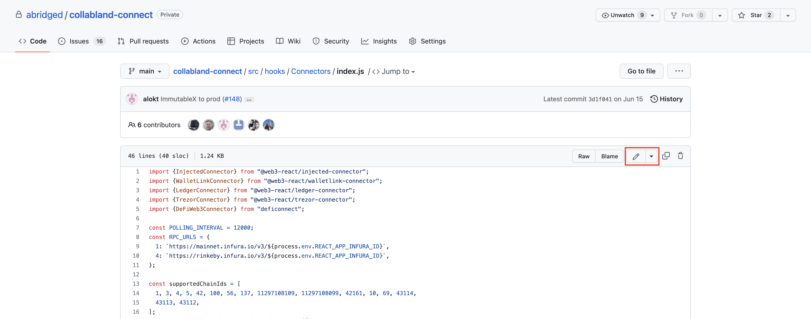
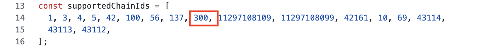

# Update the Wallet Connection Page

```mdx-code-block
<div
  style={{
    position: "relative",
    paddingBottom: "64.5933014354067%",
    height: 0
  }}
>
  <iframe
    src="https://www.loom.com/embed/753c765e94c14aa98ebe4c6a6bfaeafe"
    frameBorder={0}
    webkitallowfullscreen=""
    mozallowfullscreen=""
    allowFullScreen=""
    style={{
      position: "absolute",
      top: 0,
      left: 0,
      width: "100%",
      height: "100%"
    }}
  />
</div>
```

# Wallet Connection Page

# Editing the wallet connection page

To add a new EVM chain we only need to add the chain ID to the `supportedChainIds` array in the wallet connection page.

```bash
const supportedChainIds = [
  1, 3, 4, 5, 42, 100, 56, 137, 11297108109, 11297108099, 42161, 10, 69, 43114,
  43113, 43112,
];
```

To accomplish this complete the following steps

## Step 1: Open the File on Github

 [https://github.com/abridged/collabland-connect/blob/main/src/hooks/Connectors/index.js](https://github.com/abridged/collabland-connect/blob/main/src/hooks/Connectors/index.js)

## Step 2: Open Edit Mode

Click the pencil icon in the upper right hand corner of the file



## Step 3: Add Your Chain ID

Add your chain ID to the `supportedChanelsIds` array.

Preferably add in ascending order.



## Step 4: Commit Changes

1. Scroll down
2. Give the commit a title and body.  Follow this format

```bash
**title:**
Add EVM Chain [CHAIN_ID] - [CHAIN_NAME]

**body:**
Add EVM Chain [CHAIN_ID] - [CHAIN_NAME]

Signed-off-by: [YOUR_FULL_NAME] <[DEVELOPER_EMAIL]>
```

1. Select “Create a new branch for this commit and start a pull request”
2. Name your branch. Follow this format

```bash
**branch name:**

add-evm-chain-[CHAIN_ID]
```

1. Click “Propose Changes”


1. Create the actual pull request
    1. Make sure your merging into `main`
    2. select at least one reviewer.  You can use the gear to pick from a drop down.  Select `alokt`
    3. Click “Create pull request”


1. Recognize that you cannot merge until your change has been reviewed.


1. Copy the URL for your pull request so that you can track it’s progress
    1. [https://github.com/abridged/collabland-connect/pull/156](https://github.com/abridged/collabland-connect/pull/156)
