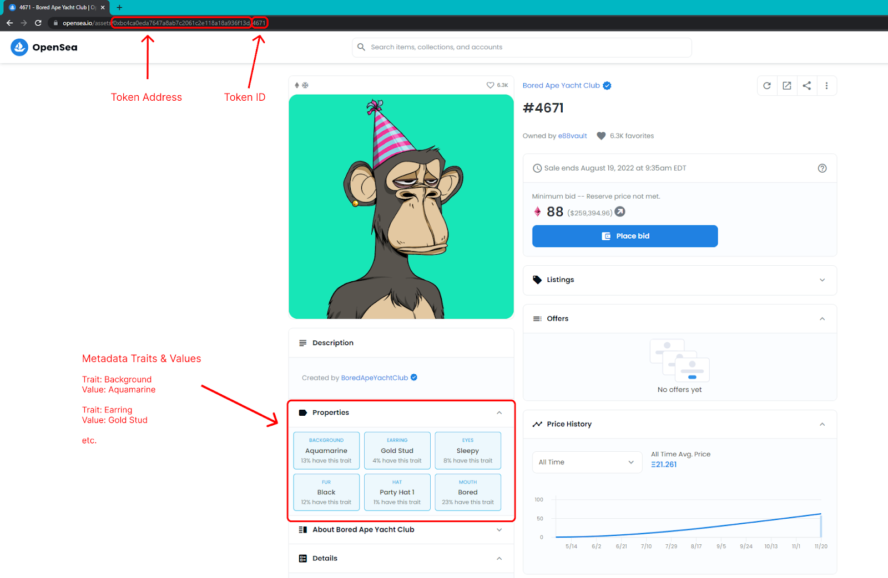
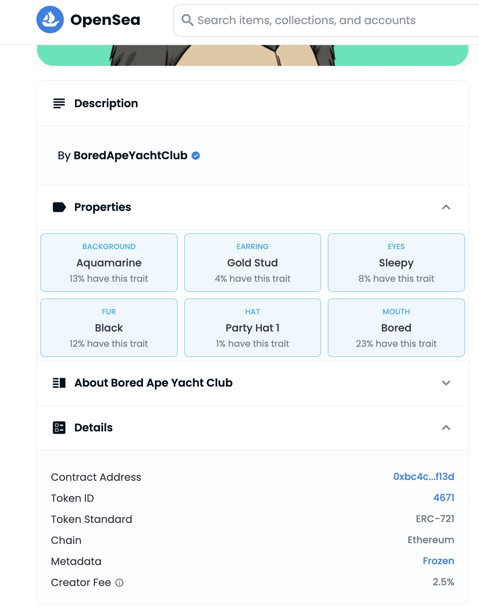

# Finding Token Details on Opensea

How to find token details on Opensea:

You can find many details about your token on Opensea, including the Token Address, Token ID, and Metadata traits and values.

You can also find the contract address and token ID in Details tab.

