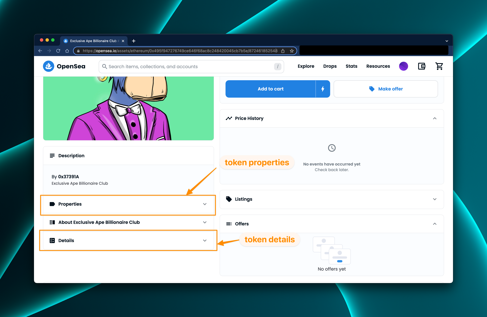
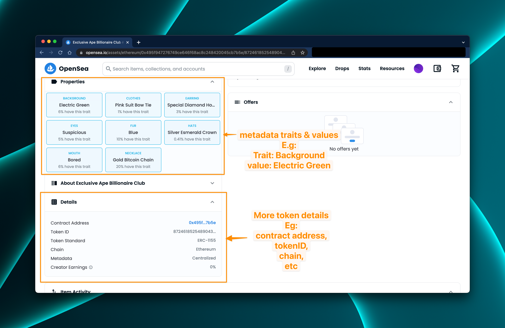

# Finding Token Details on Opensea

### How to find token details on Opensea:

You can find all the details of your token on Opensea, including the Token Address, Token ID, and Metadata traits and values.

When you open your token page on Opensea, the address bar often contains your token address and ID as can be seen on the image below:

When you scroll down below the picture of the token, you should find `properties` and `details` tabs. These tabs hold more information about the token:

Clicking on the properties tab in the image above will reveal the metadata traits and values of the token. Consequently, the details tab will reveal more details about the token like the contract address, chain, and so on:

