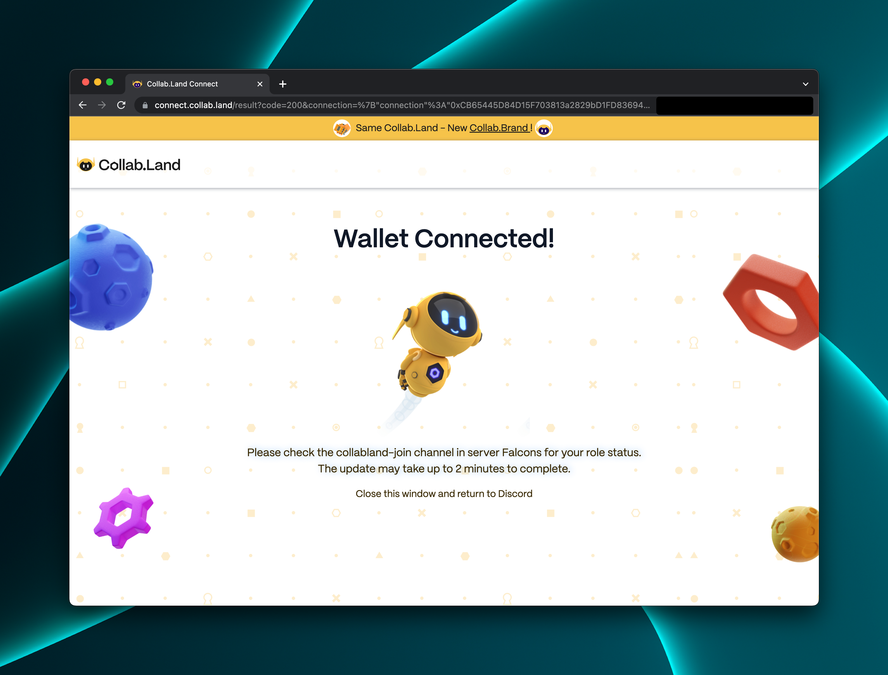

Collab.Land APIs support a few schemes of authentications.

## API key

The API key must be passed in the HTTP `X-API-Key` (case insensitive) request header.

```
X-API-Key: <api-key-for-your-client-application>
```

## Authenticated Encryption (AE) Token

Collab.Land can also generate authenticated encryption tokens for API access. Such AE tokens are JWT tokens encrypted using AWS KMS and encoded as base64 URL strings.

The AE token must be passed in the HTTP `Authorization` (case insensitive) request header.

```
Authorization: AE <ae-token>
```

## Login with Collab.Land

Client applications registered with Collab.Land can redirect users to `https://login.collab.land` to authenticate themselves with Collab.Land and grant permissions to the client application for requested resources.

For example:

https://login.collab.land/?redirect_uri=https%3A%2F%2Fcc.collab.land%2Fdashboard%2F

### Sign in with Discord or Telegram


When you select your auth platform of choice and accept the prompts, you should get a confirmation page when your wallet is connected successfully:



### Sign in with Ethereum (SIWE)

1. Get a challenge

Sample request:

```
POST /ethereum-login/challenges

x-api-key: ...
```

```json
{
  "state": "string",
  "uri": "string",
  "accountId": "string",
  "resources": ["string"]
}
```

Sample response:

```json
{
  "state": "string",
  "requestId": "string",
  "message": "string"
}
```

2. Sign the message

3. Request an AE token

```
POST /ethereum-login/id-tokens

x-api-key: ...
```

```json
{
  "requestId": "string",
  "signatureType": "string",
  "signature": "string",
  "accountId": "string"
}
```

Sample response:

```json
{
  "idToken": "string"
}
```
