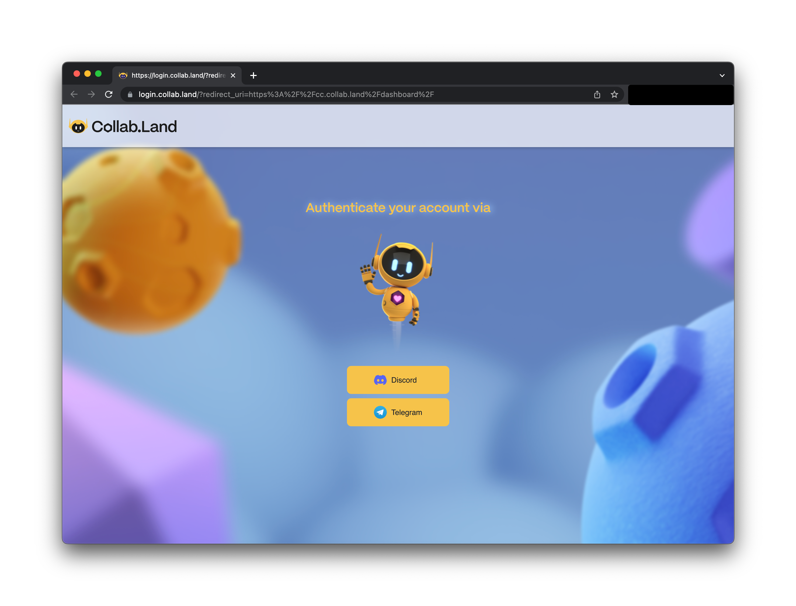
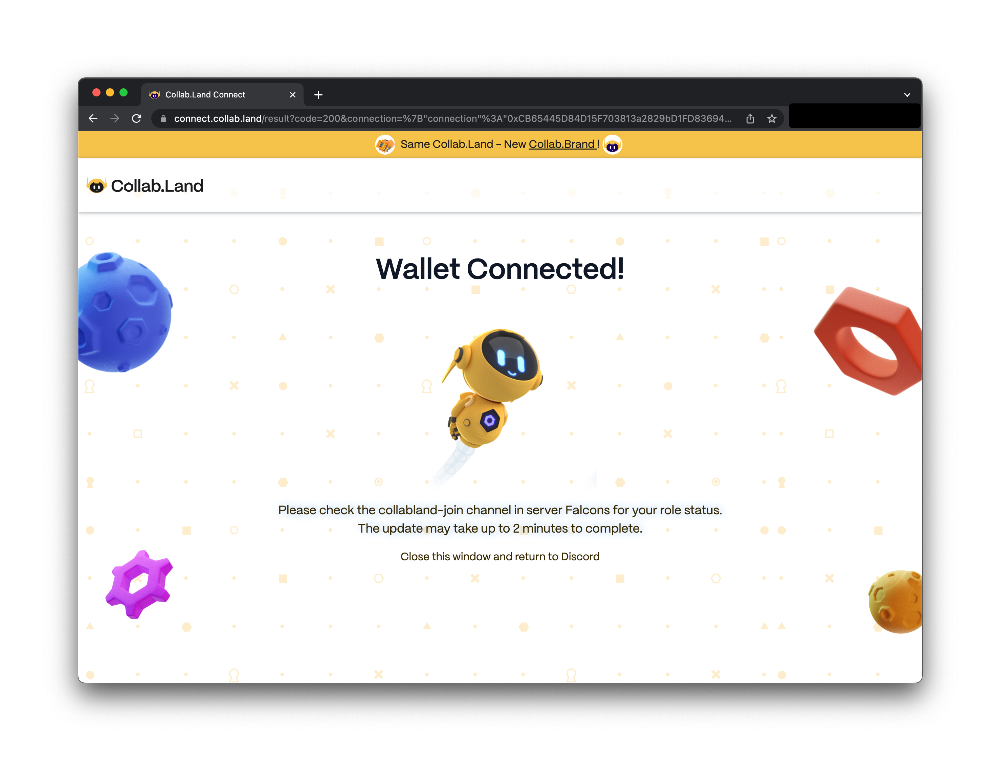

Collab.Land APIs support a few schemes of authentications.

## API key

The API key must be passed in the HTTP `X-API-Key` (case insensitive) request header.

```
X-API-Key: <api-key-for-your-client-application>
```

<!-- ## Authenticated Encryption (AE) Token

Collab.Land can also generate authenticated encryption tokens for API access. Such AE tokens are JWT tokens encrypted using AWS KMS and encoded as base64 URL strings.

The AE token must be passed in the HTTP `Authorization` (case insensitive) request header.

```
Authorization: AE <ae-token>
```

The AE token is generated on the server when a user has successfully signed in with Collab.Land. The AE token is valid for 1 hour after which it expires and will need to be refreshed. -->

## Login with Collab.Land (LWC)

The Collab.Land API OAuth2 flow provides a secure and standardized method for client applications to authenticate users and access resources on Collab.Land. The flow follows the OAuth2 protocol, allowing applications to obtain an access token that can be used to interact with the Collab.Land API on behalf of the authenticated user.

## Register your OAuth2 Client Application

To begin using the Collab.Land API OAuth2 flow, you must first register your client application via the [Collab.Land Developer Portal](https://dev-portal.collab.land/). After the registration process, you will receive the following credentials:

- **Client ID**: A unique identifier for your client application.
- **Client Secret**: A confidential string used to authenticate your client application with Collab.Land.
- **API Key**: A secret key used to authenticate your client application with Collab.Land.

These credentials are essential for initiating the OAuth2 flow and obtaining access tokens.

## Understand Scopes

Collab.Land API uses scopes to define the level of access and permissions requested by the client application. Scopes determine the resources and operations that the access token can be used for. It is crucial to understand the available scopes and select the appropriate ones based on your application's requirements.

The following scopes are available:

**account:read**

- Read all of your wallet address you connected with collab.land and balances of them.
- Read basic user information including user name, id , pfp.
- See communities you are in and administrating

**access-control:read**
Read user roles in a certain community

**asset-ownership:read**
Check ownership for the given account for the given token assets

**gm-pass:read**
Read gmPASS address and DID info

**read-vcs**
Read all public verifiable credentials issued to you

**request-vcreds**
Issue verifiable credentials to your DID (gmPASS)

**kudos:read**
Read certain type public verifiable credentials issued to you

## Login with Collab.Land (LWC) Flow

To initiate the OAuth2 flow, direct users to the Collab.Land OAuth2 authorization endpoint:

```bash
https://api.collab.land/oauth2/authorize
```

Include the following parameters in the URL:

- **`response_type`**: Set this to **`code`** for the authorization code flow or **`token`** for the implicit token flow.
- **`client_id`**: The client ID obtained during the application registration process.
- **`redirect_uri`**: The URI to which Collab.Land will redirect the user after authentication. Must be one of your registered redirect URIs.
- **`scope`**: The desired scopes requested by your application, separated by spaces.
- **`state`**: A unique string generated by your application to protect against cross-site request forgery attacks.

For example, to initiate the authorization code flow:

```bash
https://api.collab.land/oauth2/authorize?response_type=code&client_id=YOUR_CLIENT_ID&redirect_uri=YOUR_REDIRECT_URI&scope=scope1+scope2&state=UNIQUE_STATE_STRING
```

Or, for the implicit token flow:

```bash
https://api.collab.land/oauth2/authorize?response_type=token&client_id=YOUR_CLIENT_ID&redirect_uri=YOUR_REDIRECT_URI&scope=scope1+scope2&state=UNIQUE_STATE_STRING
```

Upon visiting the authorization endpoint, users will be prompted to log in with their Collab.Land account and grant the requested permissions to your application.

## Obtain an Access Token

### Authorization Code Flow

If you initiated the authorization code flow, Collab.Land will redirect the user back to the **`redirect_uri`** specified in the authorization request, along with an authorization code. Your application must exchange this code for an access token by making a request to the Collab.Land OAuth2 token endpoint:

```bash
https://api.collab.land/oauth2/token
```

Include the following parameters in the request body:

- **`grant_type`**: Set this to **`authorization_code`**.
- **`code`**: The authorization code received in the previous step.
- **`client_id`**: The client ID obtained during the application registration process.
- **`client_secret`**: The client secret obtained during the application registration process.
- **`redirect_uri`**: The same redirect URI used in the authorization request.

The response will include an access token that your application can use to authenticate subsequent API requests on behalf of the user.

### Implicit Token Flow

If you initiated the implicit token flow, Collab.Land will include the access token directly in the URL fragment of the **`redirect_uri`**. Your application can extract the token from the URL fragment using client-side JavaScript.

### Call APIs with Access Token

To access the Collab.Land API on behalf of the authenticated user, include the access token as the Bearer token in the **`Authorization`** header of your API requests:

```bash
GET /api/resource
Authorization: Bearer ACCESS_TOKEN
```

Replace **`ACCESS_TOKEN`** with the actual access token obtained in the previous step.

The Collab.Land API will validate the access token and authorize the requested actions based on the associated user and scopes.

Remember to handle token expiration and obtain refreshed tokens when necessary to ensure uninterrupted access to the Collab.Land API. By following this flow, your client application can securely authenticate users and interact with the Collab.Land API to leverage the provided resources and functionalities.

<!-- The LWC flow process offers a way for client applications to authenticate their users through Collab.Land. Applications registered with Collab.Land can redirect users to `https://login.collab.land` to authenticate themselves with Collab.Land and grant permissions to the client application for requested resources.

Once a user has been successfully authenticated, the client app receives an access token that can be used to request user data tailored to the application's requirements.

For example:

https://login.collab.land/?redirect_uri=https://cc.collab.land/dashboard will prompt you to login with Discord, Telegram or any other Collab.Land supported platforms.


The `redirect_uri` parameter is required. This is the URL that the user will be redirected to after the authentication process is complete.

> The `LWC` flow is not publicly available yet, so it only works in development and with whitelisted domains. If you want to use this method, be sure to inform the Collab.Land team before development or submit a request via [the API Request Form](https://forms.gle/GbtyiQyBkUH1bwsL8) -->

<!-- ### Sign in with Discord or Telegram



You should receive a confirmation page when you sign in successfully via your authentication platform of choice. For instance, an authenticated wallet connection confirmation page would look like this:

 -->

### Sign in with Ethereum (SIWE)

1. Get a challenge

Sample request:

```
POST /ethereum-login/challenges

x-api-key: ...
```

```json
{
  "state": "string",
  "uri": "string",
  "accountId": "string",
  "resources": ["string"]
}
```

Sample response:

```json
{
  "state": "string",
  "requestId": "string",
  "message": "string"
}
```

2. Sign the message

3. Request an AE token

```
POST /ethereum-login/id-tokens

x-api-key: ...
```

```json
{
  "requestId": "string",
  "signatureType": "string",
  "signature": "string",
  "accountId": "string"
}
```

Sample response:

```json
{
  "idToken": "string"
}
```
