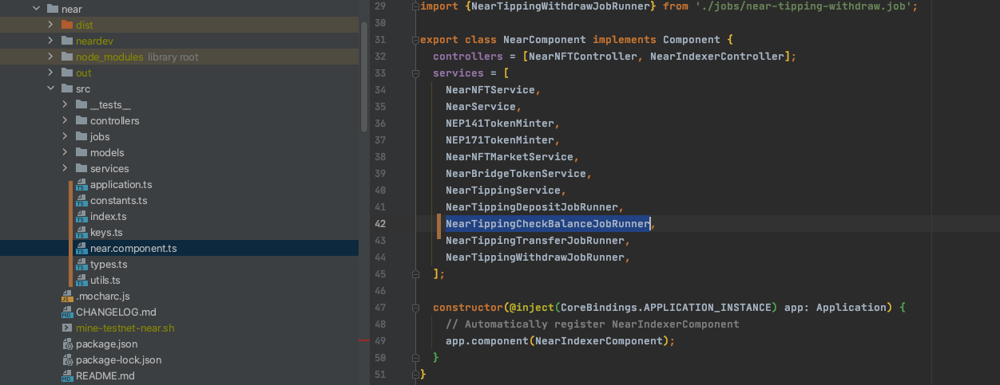

# 4. Connecting Your Job

# Register Job Locally

After building your jobs, services, etc.  You'll need to register your new job in

`components/near/src/near.component.ts`

You should also read the other files in `./src` to see what they do



# Register Job in Job-Service/Package

**The job service will not create an instance of your job runner unless you register it in the Job-Service package**

1. Find the name of your component in its package.json 

`components/near/package.json`

```json
{
  "name": "@collabland/component-near",
```

1. Import it into this file

`packages/job-server/src/application.ts`

```jsx
import {NearComponent} from '@collabland/component-near';
```

And register below

```jsx
this.component(NearComponent);
```