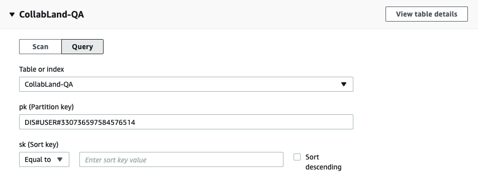

# 3. Creating a Job

# Overview

## Job vs API

- Job: long running tasks
- API instant response from our DB

## How the Job Queue Works

- The job queue is a Pub/Sub designed by @Raymond Feng
- Jobs submitted to the Queue are picked up by processors subscribed to a specific topic
- Each request and response is given a specific name like `near-tipping-check-balance-request`
- The Node Red bot interface (which is being deprecated) listens for specific responses like `near-tipping-check-balance-response`
- Note: a job can also kick out responses and we can have job runners that listen for those job response types and run a follow up job.
    - (TODO: Whats a good example of this @Raymond Feng?
    

# Getting Started

It is highly recommended that you copy an existing job the first time & read all this documentation to understand how it works and what to change. 

It is also very useful to copy values from an existing job, search them, and find all the places that they are used

# The Code: Near Tipping Check Balance as Example

> **components/near/src/jobs/near-tipping-check-balance.job.ts**
> 

## Request Interface

```jsx
export interface NearTippingCheckBalanceRequest{
	userId: string;
}

...
async run(request: JobRequest<NearTippingCheckBalanceRequest>){}
...
async checkTokenBalancesByUserId(req: NearTippingCheckBalanceRequest,
```

- This typescript definition is used to describe the incoming request body.  In this example userId must be provided

## Response Interface

```jsx
export interface NearTippingCheckBalanceResponse
  extends NearTippingCheckBalanceRequest{
	balances: NearWalletBalance[];
  error?: object;
}
```

- This typescript object is used to describe the respons.  In this example the request values are returned in the response.  An array of account balances is also returned along with an optional error.

> **Typescript Tips**
> 
1. **extends NearTippingCheckBalanceRequest**: The response also includes the request values.  Note these values still need to be passed to the response.
2. **NearWalletBalance[]** defines balances is an array of type NearWalletBalance which is imported from Models.  NearWalletBalance has a number of predefined fields.
3. **error?** means that the variable error is optional

## Injectable

```jsx
@injectable(
  {scope: BindingScope.SINGLETON},
  extensionFor(JOB_RUNNER_EXTENSION_POINT),
)
```

**SINGLETON vs. REQUEST**

### Loopback

- SINGLETON means that this component/ class has no "state".  All data needed for execution is passed from the request and leaves from the response.  If code is structured as a SINGLETON loopback only runs one copy no matter how many requests are being called.
- REQUEST or Request Scope means that there is state stored within the class, in this case one instance of the class can be different from another.  With this knowledge Loopback can make more copies.
- Documentation: [https://loopback.io/doc/en/lb4/Binding.html](https://loopback.io/doc/en/lb4/Binding.html)

## Class Definition

```jsx
export class NearTippingCheckBalanceJobRunner
  extends NearTippingJobRunner
  implements
    JobRunner<NearTippingCheckBalanceRequest, NearTippingCheckBalanceResponse>
```

1. Choose a new class name.  Name should end in `JobRunner`
2. If you have multiple related job runners it may be wise to have a base class like `NearTippingJobRunner`
3. Implement the Request and Response interfaces you've defined above

## Constructor

```jsx
constructor(
	@inject(NEAR_TIPPING_SERVICE)
	private nearTippingService: NearTippingService,
	  @repository(BotRepository)readonly repo: BotRepository,
	) {
	super(repo);
}
```

[  🚧  🚧  DOCUMENTATION UNDER CONSTRUCTION 🚧  🚧  ] @Raymond Feng how would you describe the inject, repo import?

## Supports

```jsx
supports(type: string): boolean{
	return type === 'near-tipping-check-balance-request';
}
```

When the job runner gets a new job it matches the request type to the job which can run that code. `near-tipping-check-balance-request`

## "Run" Runner

```jsx
async run(request: JobRequest<NearTippingCheckBalanceRequest>) {

	debug('Request: %O', request);
	const body = request.body;
	
	const balancesAndError = await this.checkTokenBalancesByUserId(body); 

	const response: JobResponse<NearTippingCheckBalanceResponse>={
			type: 'near-tipping-check-balance-response',
	    headers:{
				requestId: request.id!,
			},
		    body:{
					...body,
		      ...balancesAndError,
				},
			};
  debug('Response: %O', response);

  return response;
}
```

`run()` is the main entry function for a job.

The request body is wrapped in a JobRequest.  The body must match the TS definition for `NearTippingCheckBalanceRequest`.

body can be passed to another function.  That function can be in the same file or abstracted to the service folder.

Note how the response is given a type as well `near-tipping-check-balance-response`.  Listeners can start more jobs on specific response types.  Also listeners see these responses and forward data to the users who requested the job.

## Service Function

```jsx
async checkTokenBalancesByUserId(
	req: NearTippingCheckBalanceRequest,
): Promise<NearWalletBalancesAndError> {
	const userId = req.userId;
```

`const userId = req.userId;` get the request input values and save to individual constants

```jsx
const resultSet = await this.findNearWalletsByUserId(userId);
-> calls -> 
return this.repo.findByClassifierPK('WALLET#NEAR', userPk);
```

`findNearWalletsByUserId` is a function that has been abstracted to the base class because it's used throughout NEAR tipping

`findNearWalletsByUserId` requests data from the AWS DynamoDB table for the given Discord users ID & the given 




To get access to the AWS QA database ask @Raymond Feng. We will soon have a new prototyping isolated environment that can be run for each [Collab.Land](http://Collab.Land) developer.  

Ask about this set up.

```jsx
if (resultSet.items.length === 0) {
      return {
        balances: [],
        error: {
          message:
            'Cannot check the balance of funds before linking your NEAR account to this community.',
        },
      };
    }
```

The return object matches the typescript definition of `NearWalletBalancesAndError` which makes both balances and error optional.  This way the same typescript object can return both a successful and unsuccessful result.

```jsx
const nearWalletBalances: NearWalletBalance[] = [];

```

`nearWalletBalances` is an array of multiple `NearWalletBalance` typescript objects

```jsx
for (const w of resultSet.items) {
      const wallet = w as NearWallet;
      /** NOTE: Default to near for now, can extend to more tokens later. */

      const balance = await this.nearTippingService.getNearTippingBalance(
        wallet.nearAccountId,
      );
      nearWalletBalances.push({
        nearAccountId: wallet.nearAccountId,
        // nearPublicKey: wallet.nearPublicKey, //PROBABLY NOT NEEDED
        balance: formatNearAmountAsHumanReadable(balance),
      });

      break; /** Note: only supporting 1 near account per user for now. */
    }
```

Loops through for each NEAR account linked to the users [Collab.Land](http://Collab.Land) account.  

Note the `break;` we currently only support one NEAR wallet for tipping

`getNearTippingBalance`: this function is defined in the nearTippingService & calls connector/near to request data from the near tipping contract. 

```jsx
		return {balances: nearWalletBalances};
	}
}
```

Returns an array of balances.  No error object returned.