# Discord 13

# 12/15/21 Discord Lesson Alok

# Raw Notes

Register a slash command in QA how?

Pass that command to a Job

- Read notes for how to add command
- Can directly call the register
    - When I run this project it will pick up QA tokens.   If you create your own bot you can override with env variables to add commands to your own discord bot.
    - I have to manually register the slash command with my discord bot through discord.service.ts... I think.
- Read the discord docs on how to generate a slash command
- Copy the existing echo.command.ts to mess around with it

- Caleb Google invisible message

there is a commandHandler & a buttonHandler that filters out responses to the correct Typescript file.

plane message vs Ember message

Ember we can set text, image, footer, etc

We'll for sure get issues. 

I should use my own bot token

Application create

If I dont use my own bot token it will send to QA server

Will need to set up Ngroc to get the webhook setup

# Job VS API

Caleb Gates, [Dec 15, 2021 at 11:16:37 AM]:

@aloksstiwari For discord 13 will a job use the job server queue? or can I just put code to execute in the incoming webhook file?

Or should the slash command webhook file pass data to the job queue so we don’t overload the system CPU?

**ANSWER:**

that depends on requirement, we’ve decided to devide it into two categories:

1. if command response can be responded quickly then we should just use interaction.reply i.e /help
2. if command processing need more time then this should be submitted to Job-Server i.e `/tip <all role holders>` this command might run for 10 mins or more so this is best candidate to go for job-server

# Conclusions:

- There will be errors so reach out to Alok as we all learn how this should work
- Not all commands are moved from node red yet
- it definitely going to take some setup for Dev environment for our own bot, Ngrok, CLI to deploy new slash commands,
- Going to have to research discord 13 and understand how to code all the new functionality.

# Goal:

- Get local env set up for discord
- Create a tip slash command

# If you set ENV variables it will override the QA ones

```bash
start.sh params for local env 

#!/bin/bash
echo "Starting project"

export DISCORD_CLIENT_ID=
export DISCORD_CLIENT_SECRET=
export DISCORD_BOT_TOKEN=
export DISCORD_PUBLIC_KEY=

export DEBUG=collabland:solana
export COLLABLAND_ENV=qa
# npm start
#npm run build
node --enable-source-maps .
```

Find the above variables @ [https://discord.com/developers/applications/906567902176632832/oauth2/general](https://discord.com/developers/applications/906567902176632832/oauth2/general)

Set up your own bot. Convert to a bot if you see that button.  Then copy the variables from a few different tabs.


# Screen Shots of Monorepo

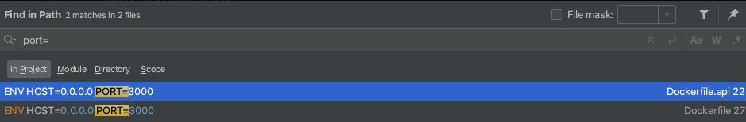

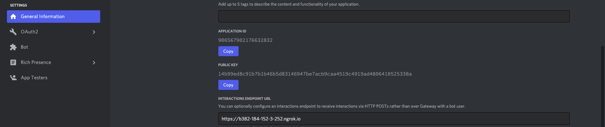

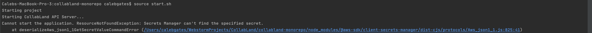

How does this work to register a new command

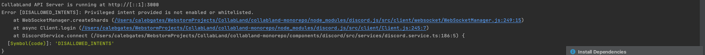

[https://www.notion.so](https://www.notion.so)

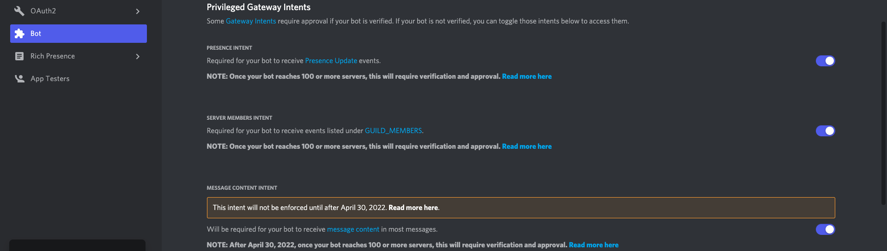


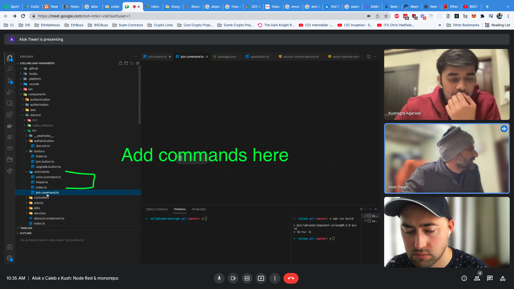


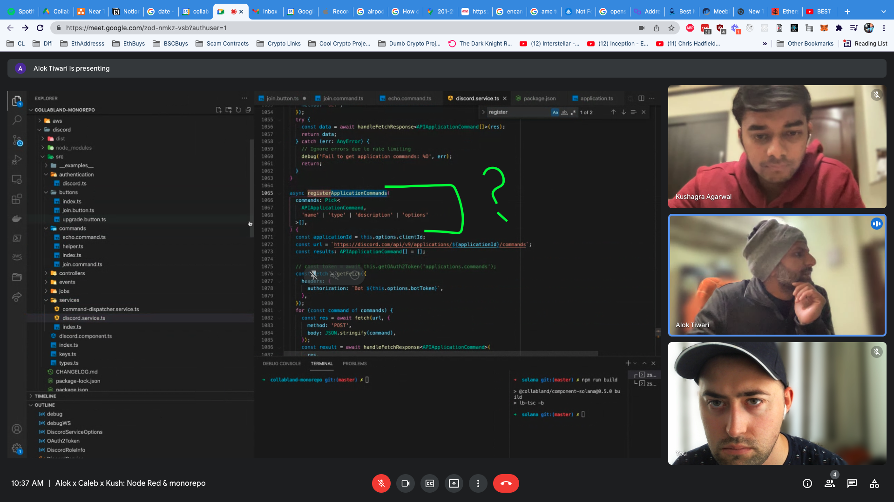

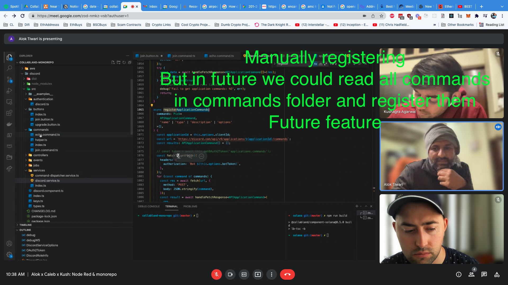

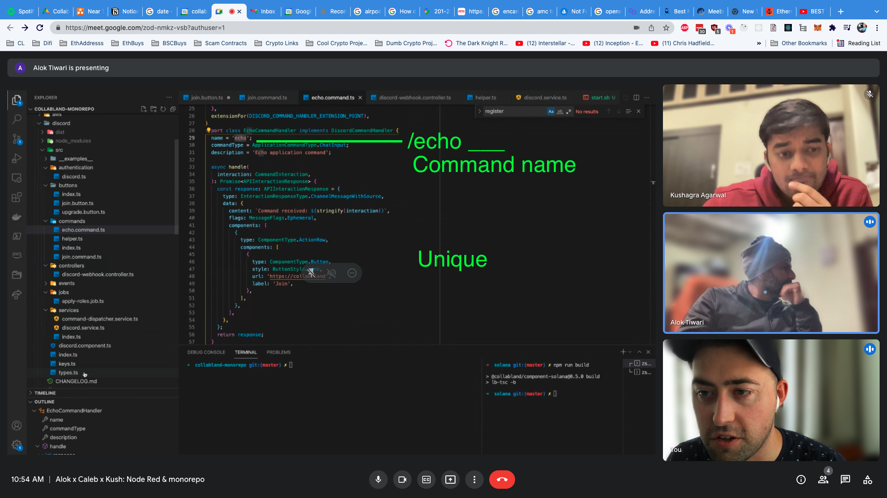

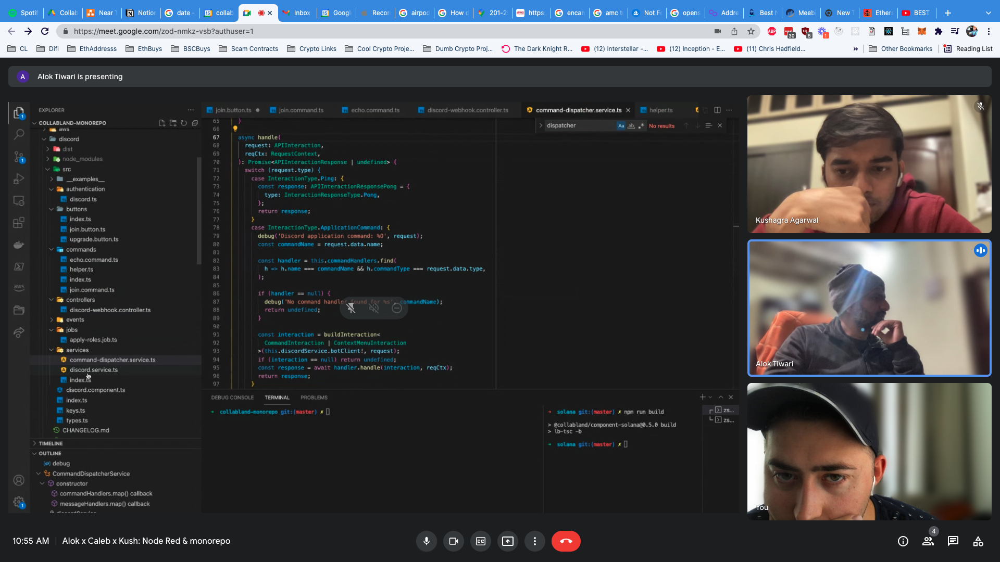


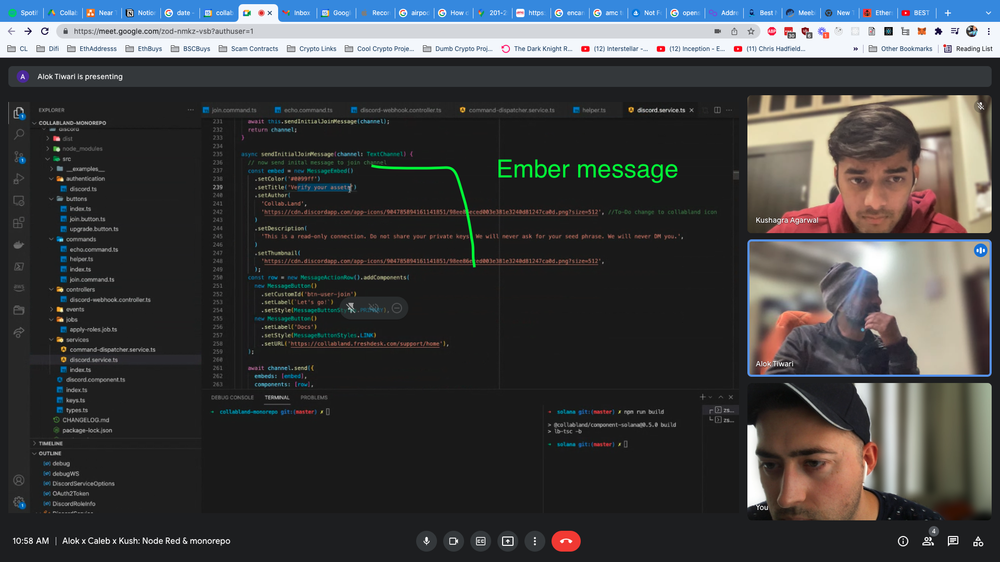


# NGROK SETUP

Ngrok helps you forward http calls through your fire wall to local host.

Install ngrok for Mac OS:

[https://ngrok.com/download](https://ngrok.com/download)

```bash
brew install ngrok/ngrok/ngrok
```

Start Tunnel

```bash
ngrok http 3000
```

Command line output

```bash
ngrok by @inconshreveable                                                                                                                                (Ctrl+C to quit)
                                                                                                                                                                         
Session Status                online                                                                                                                                     
Session Expires               1 hour, 59 minutes                                                                                                                         
Version                       2.3.40                                                                                                                                     
Region                        United States (us)                                                                                                                         
Web Interface                 http://127.0.0.1:4040                                                                                                                      
Forwarding                    http://0292-184-152-3-252.ngrok.io -> http://localhost:3000                                                                                
Forwarding                    https://0292-184-152-3-252.ngrok.io -> http://localhost:3000                                                                               
                                                                                                                                                                         
Connections                   ttl     opn     rt1     rt5     p50     p90                                                                                                
                              0       0       0.00    0.00    0.00    0.00
```

Starts a tunnel to forward traffic from 

```bash
http://0292-184-152-3-252.ngrok.io -> http://localhost:3000
```

What port does Monorepo listen on?  Find out in code.  then start that tunnel, then forward traffic from discord website. 

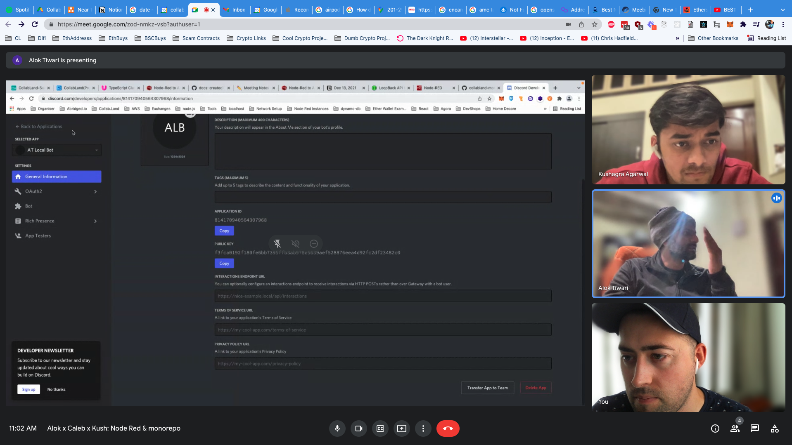

- Looks like port 3000 is correct
- Tunnel already running on port 3000

## Set URL in Discord webhook

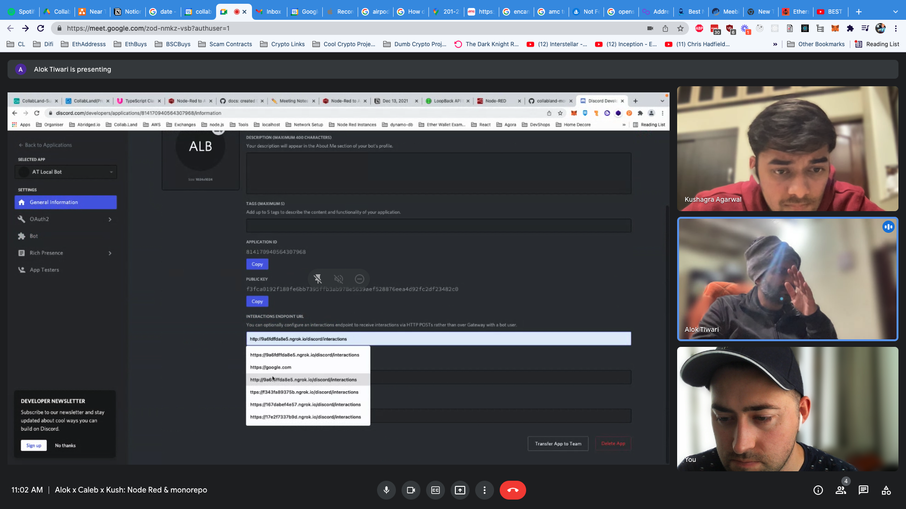

- Note: New NGROK url every time you restart ngrok.  Really like bespoken (I think that was the alexa gateway) because you get a consistent url.  But optimizations, ignore, using Ngrok.
    - Will need to update URL each testing session

## Trouble Shooting.

- Getting bad gateway in terminal.
    - I beleive that discord is trying to send a post request when it saves the Ngrok url to determine if its valid. I think that's being rejected by Ngrok because there's no service running on port 3000.  TODO: start monorepo then try and save ngrok url into discor.
    - 

### Failure to start Monorepo

- ERROR: "**Secrets Manager can't find the specified secret.**"
    - Believe that's because I didnt define my AWS profile in the terminal.
    - I added AWS_PROFILE=dev to start.sh.  I have previouly set up my profile under dev.  That may be for sandbox though.  I may have to set up another profile for QA.
        - This eliminated this error. On to the next one.
    - I really should set up the secrets manager properly using the mac keychain however Raymond uses it.
    - 

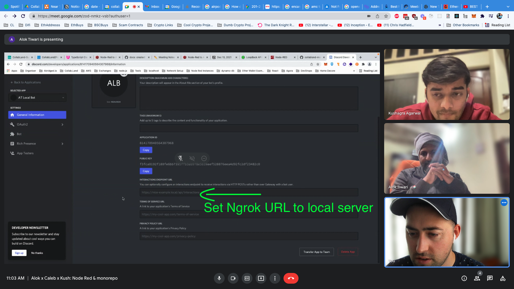

- ERROR: "**Privileged intent provided is not enabled or whitelisted**"
    - I moved my helloworld file just incase I'm throwing the error.  I want the repo to be as close to master as possible while I get this running.


- Try these commands
    - npm install
    - npm run build
    - source start.sh
- Still getting the previous error "**Privileged intent provided is not enabled or whitelisted**"
    - Option 1: Google ANSWER
        - [https://githubmemory.com/repo/Spiderjockey02/Discord-Bot/issues/99](https://githubmemory.com/repo/Spiderjockey02/Discord-Bot/issues/99)
            - Says to configure on discord developer page. but not much more info.
    - Option 2: Configure debugger and trace specific error

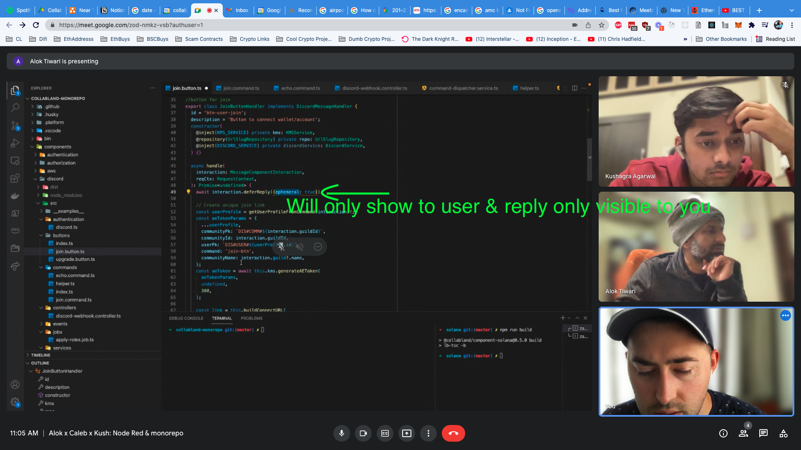

- Turned on these check boxes.
    - Monorepo started on port 3000!! Success

```bash
$> source start.sh
Starting CollabLand API Server...
CollabLand API Server is running at http://[::1]:3000
```

- NEXT ERROR:  We upgraded from 502 to 404! NICE
    - Discord still wont take my ngrok url.  When I hit save it pings my computer and gets a 404 now.  So it's clearly connecting but unhappy with the endpoint/ monorepo response.

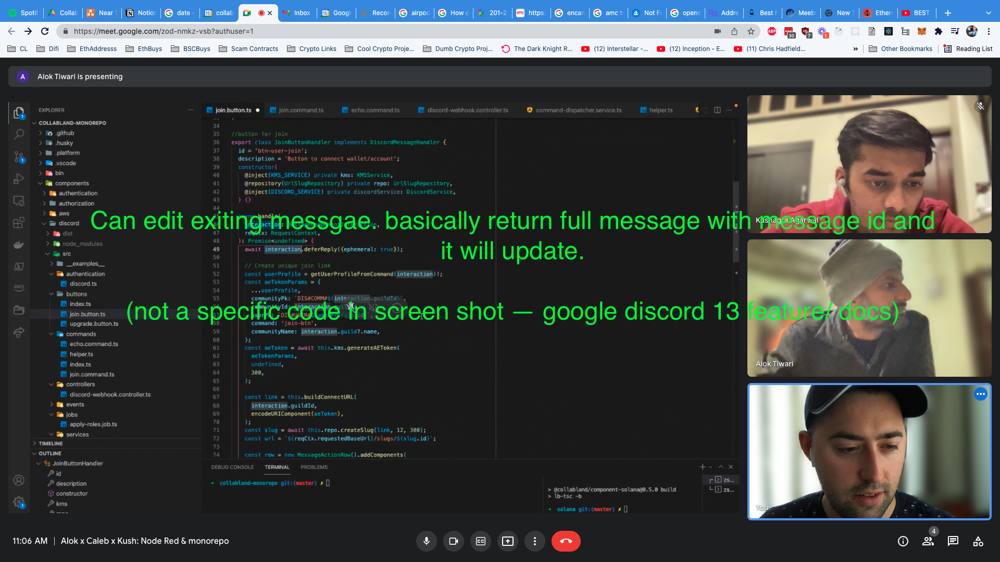

- Best bet is there is no simple response for posting to / endpoint.  How do I make that happen?  Alok must have something working.
    - Alok did you add anything to the end of your ngrok url like a file path?
        - `https://0292-184-152-3-252.ngrok.io/discord/webhooks???`
    - ANSWER: Yes
        - `https://0292-184-152-3-252.ngrok.io/discord/interactions`

# Working:

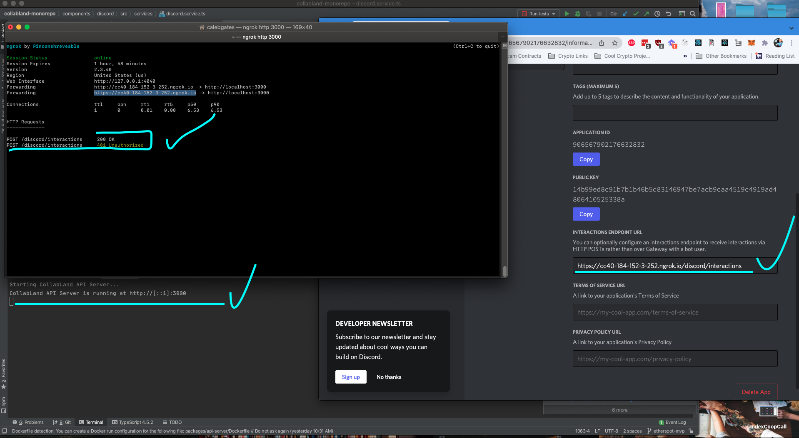

# NEXT: Use CLI to push commands to my bot?

# ...? (type my Etherspot game plan notes then come back to this)

Trying to figure out how to push commands to my discord bot.

Alok said he has success with command builder 

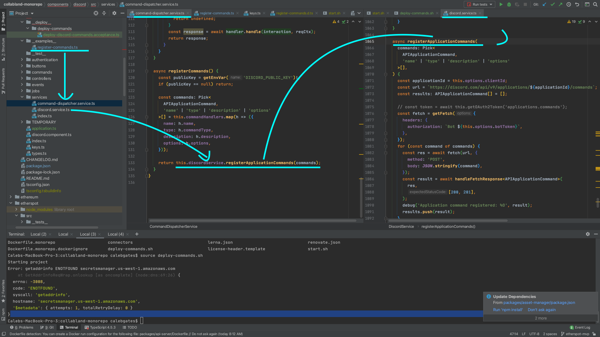

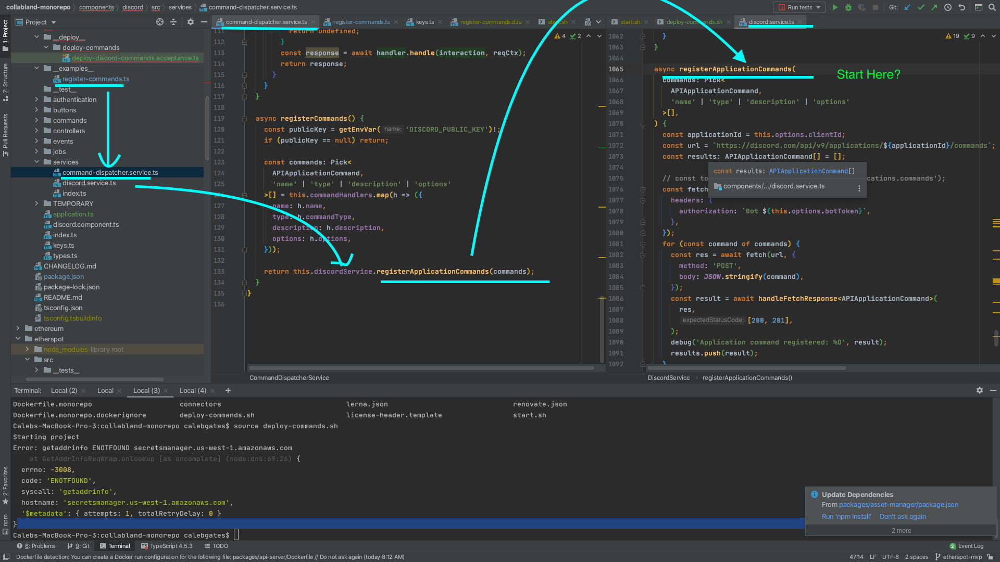

# Creating Slash Commands through Discord.JS directly

### helpful video

- [https://www.youtube.com/watch?v=pXehoXnFxPM](https://www.youtube.com/watch?v=pXehoXnFxPM) - watch on 2x speed
    - learned a lot of small things
        - Required variables in slash commands
        - Variable types
        - 3 second time to reply
        - Can edit a reply with deferReply & editReply
        - guild vs global slash commands. Use guild for testing, is instant.  Global when ready but can take up to an hour to become available.
- Next in series:
    
    

# Building new commands with Monorepo works!

**Try this ping and see what it returns:**

```bash
Calebs-MacBook-Pro-3:collabland-monorepo calebgates$ source env.sh
Calebs-MacBook-Pro-3:collabland-monorepo calebgates$ ping secretsmanager.us-west-1.amazonaws.com
PING secretsmanager.us-west-1.amazonaws.com (54.183.130.28): 56 data bytes
Request timeout for icmp_seq 0
Request timeout for icmp_seq 1
Request timeout for icmp_seq 2
Request timeout for icmp_seq 3
Request timeout for icmp_seq 4
Request timeout for icmp_seq 5
Request timeout for icmp_seq 6t
```

**Then Try this & it should work**

Register-Commands should search all the command files and register them seperately.

```bash
Calebs-MacBook-Pro-3:collabland-monorepo calebgates$ cd components/discord/
Calebs-MacBook-Pro-3:discord calebgates$ node dist/__examples__/register-commands
[
  {
    id: '901177371166650448',
    application_id: '715138531994894397',
    version: '921070140064432198',
    default_permission: true,
    default_member_permissions: null,
    type: 1,
    name: 'echo',
    name_localizations: null,
    description: 'Echo application command',
    description_localizations: null,
    dm_permission: null
  },
  {
    id: '911717610654154822',
    application_id: '715138531994894397',
    version: '921070140685180979',
    default_permission: true,
    default_member_permissions: null,
    type: 1,
    name: 'join',
    name_localizations: null,
    description: 'Connect to wallets',
    description_localizations: null,
    dm_permission: null
  }
]
```

## NO: /ping is not showing up in my bot.

I may have not run the [start.sh](http://start.sh) file to override the bot variables.

Trying that now then seeing if it fails

Wait!! not saying that it registers ping. It's registerng echo.  See if that exists. (I also just dropped all 4 discord env values in the command line and ran again. so if commands do exist it may be that they just got added. going to be hard to say causation. I do know that I need to override to send to my discord app though wtih env variables.

NOPE: Still no command.  
SO this is where I say "is this a guild register or global register"

Let me see if I can modify build command to use guild register so new commands appear automatically.

# Next: Create my own command

# Want to do Guild Commands so register faster for testing

We're currently registering commands with a post request to this URL.  What we should do is use the new discord register guild or no guild.

```bash
async registerApplicationCommands(
    commands: Pick<
      APIApplicationCommand,
      'name' | 'type' | 'description' | 'options'
    >[],
  ) {
    const applicationId = this.options.clientId;
    const url = `https://discord.com/api/v9/applications/${applicationId}/commands`;
    const results: APIApplicationCommand[] = [];

    // const token = await this.getOAuth2Token('applications.commands');
    const fetch = getFetch({
      headers: {
        authorization: `Bot ${this.options.botToken}`,
      },
    });
    for (const command of commands) {
      const res = await fetch(url, {
        method: 'POST',
        body: JSON.stringify(command),
      });
```

HMM: so slash commands don't show up in my discord even though the bot is in my server. But if I try and DM the bot the /echo command shows up.


Why is that?

How can I make the / commands appear in my discord?

## 1. Try to make another command and see if it shows up immediately

- Trouble shooting: Added the new helloworld file but am fighting the 'npm run build' process because I want to see the helloworld.command.js file show up in the /dist file.
    - Make build work → then deploy to bot.
- Getting error `import {setTimeout} from 'timers/promises';`
    - [https://stackoverflow.com/questions/67187670/how-can-i-use-timers-promises-from-node-16-in-a-typescript-project](https://stackoverflow.com/questions/67187670/how-can-i-use-timers-promises-from-node-16-in-a-typescript-project)
- I checked out master & Stashed everything & ran
    - `npx lerna clean`
    - `npm run build:full`
        - build without error. IDK what lerna clean does but probably did the right thing.
    - Conclusions
        - Need to run build at root level
        - If I run build at components/discord folder I keep getting "@_____/—__ dependency not found.  IDK why that's differnet if I build at root level.
    - Confusion
        - My hello world command ends up in the dist directory dist/command/helloworld.command.js  BUT it doesnt get deployed when I run `node dist/__examples__/register-commands` but echo and join do.

- console: ngrok http 3000
- console 2: source start.sh
- update discord develper with ngrok url
- dm my bot /echo & I recieve a response!
- Next Goal: Hello world command registered.
    - TODO: Check if I missed registering it anywhere.
    - OMG ok, with rebuilt from root direcoty it's no longer in the dist folder. So find helloworld. then rebuild from root directory, then see if I have to register it anywhere, rebuild agian, try and deploy.

## 2. See if I can update the actual deploy script to use the guild.id

# Genrate invite link and reinvite to server:

[https://discordapi.com/permissions.html#1099511627775](https://discordapi.com/permissions.html#1099511627775)

[https://discord.com/developers/applications/906567902176632832/oauth2/general](https://discord.com/developers/applications/906567902176632832/oauth2/general)

Link: [https://discord.com/oauth2/authorize?client_id=906567902176632832&scope=bot&permissions=545394785535](https://discord.com/oauth2/authorize?client_id=906567902176632832&scope=bot&permissions=545394785535)

Editing Handler to deploy guild specific commands

[https://discord.com/developers/docs/interactions/application-commands](https://discord.com/developers/docs/interactions/application-commands)

# LOOM VIDEOS

## 1. Setting up a new slash command, Ngrok, discord bot, the ground work.

[https://www.loom.com/share/4e2f04cc5d294ffe8d6290d7cdcbd24c?sharedAppSource=personal_library](https://www.loom.com/share/4e2f04cc5d294ffe8d6290d7cdcbd24c?sharedAppSource=personal_library)

## 2.  Deploying a slash command to a guild instantly

[https://www.loom.com/share/b9d25d6aa0cf49dcb714e591f0790b01](https://www.loom.com/share/b9d25d6aa0cf49dcb714e591f0790b01)

## 3. Getting the slash command to respond

— Current Status

[https://www.loom.com/share/3f5600055bb9411d866bdd9633631eea](https://www.loom.com/share/3f5600055bb9411d866bdd9633631eea)

— Once it works

## 4. Upgrading the slash commands inputs

## 5. Validating the inputs before calling a Job Runner

# TODO

- [ ]  Submit pull request for JUST deploy slash command to guild. So that Kushagra and Alok can access its new functionality for testing.  They should have to wait for tipping to be completed