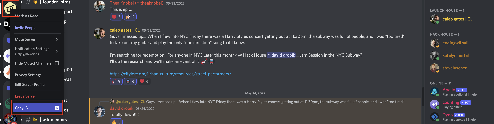
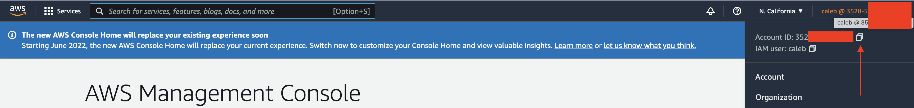
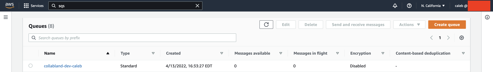
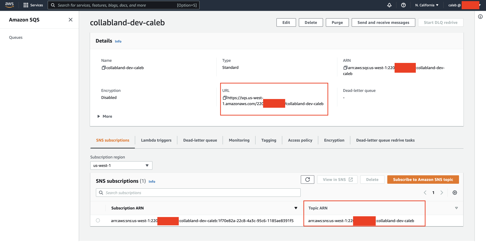

# Create Environment Files for Backend Servers

There are three types of Collab.Land servers that can be started from the `collabland-monorepo` project:

1. API Server (exposing REST APIs and webhooks)
2. Job Server (accepting job requests from AWS SQS and invoking job runners to process requests)
3. Discord Server (connecting to Discord using websocket and listening on Discord events)

To run Collab.Land servers locally, a few environment variables need to be set to point to your local
development environment including you AWS account, Discord bot, and Redis server.

## Step 1: Set up environment variables for local servers

### 1. Create or update local server env

```bash
touch bin/local-server-env.sh
```

### 2. Copy the following code into that file

Copy the following code into it.

```bash
#!/bin/bash

# Set AWS profile for AWS Vault
export AWS_PROFILE=dev

export AWS_ACCOUNT=[AWS-ACCOUNT-ID]

# Will Be configured Below
export DISCORD_GUILD_ID=[COPIED-FROM-DISCORD-INTERFACE]
export DISCORD_CLIENT_ID=[COPIED-FROM-DISCORD-DEVELOPER-PORTAL]
export DISCORD_CLIENT_SECRET=[COPIED-FROM-DISCORD-DEVELOPER-PORTAL]
export DISCORD_BOT_TOKEN=[COPIED-FROM-DISCORD-DEVELOPER-PORTAL]
export DISCORD_PUBLIC_KEY=[COPIED-FROM-DISCORD-DEVELOPER-PORTAL]

export COLLABLAND_JOB_QUEUE=https://sqs.us-west-1.amazonaws.com/[AWS-ACCOUNT-ID]/collabland-dev-[PROJECT-NAME]-[TEAM-NAME]
export COLLABLAND_JOB_TOPIC=arn:aws:sns:us-west-1:[AWS-ACCOUNT-ID]:collabland-dev-[PROJECT-NAME]-[TEAM-NAME]

# Wallet connect UI URL
export COLLABLAND_CONNECT_URL=http://localhost:3002

export DEBUG=collabland:*
export COLLABLAND_ENV=[PROJECT-NAME]-[TEAM-NAME]-[ENV-NAME]
# i.e. tarmac-dev

export COLLABLAND_SECRET_NAME=collabland-api/qa
# the shared QA secret in sandbox as there yet has to be a process in place to handle individual secrets, this step is not needed if you're using your own aws organization as the secret will be named according to your team-env preference and populated by yourself

# Running Redis Locally
## brew services start redis
export REDIS_HOST=localhost
export REDIS_USERNAME=default
export REDIS_PASSWORD=
```

**`COLLABLAND_ENV`** Will be given by Collab Land team.

## Step 2: Save all Discord Credentials into [ENV].sh’s

### 1. Identify the Variables to Replace

This are the necessary variables for the `api-server` for the Discord Bot to run properly

```bash
export DISCORD_GUILD_ID=[COPIED-FROM-DISCORD-INTERFACE]
export DISCORD_CLIENT_ID=[COPIED-FROM-DISCORD-DEVELOPER-PORTAL]
export DISCORD_CLIENT_SECRET=[COPIED-FROM-DISCORD-DEVELOPER-PORTAL]
export DISCORD_BOT_TOKEN=[COPIED-FROM-DISCORD-DEVELOPER-PORTAL]
export DISCORD_PUBLIC_KEY=[COPIED-FROM-DISCORD-DEVELOPER-PORTAL]
```

Here's where to find them:

### 2. Finding Discord Bot Values

1. Go to [https://discord.com/developers/applications](https://discord.com/developers/applications)
2. Select your bot
3. On the “General Information” tab copy and save into both ENVs the value of `PULBIC KEY`
   1. TIP: We recommend copying them all into 1 ENV file then copying all the values to the other file
4. On the “OAuth2” tab copy and save into both ENVs the values of `CLIENT ID` and `CLIENT SECRET`
5. On the “Bot” tab select “Reset Token” and then copy and save into both ENVs the value of `TOKEN`

### 3. Finding **Discord Channel Values**

1. open the Discord Web App or Desktop app. To copy the guild id (or “server id”) right click the server id icon in the left nav bar and select “Copy ID”. If you do not see this option you’ll need to enable developer mode. Save the value into both ENV files.

   

   1. How to enable Developer Mode: [https://www.youtube.com/watch?v=e_UoIwmS8Xk&t=35s](https://www.youtube.com/watch?v=e_UoIwmS8Xk&t=35s)

## Step 3: Finding your AWS Account Values

### 1. Logging into AWS

To login to AWS from the command line use:

```bash
aws-vault login [CREDENTIAL NAME]
aws-vault login dev
```

### 2. Finding your Account ID

Then copy your account ID in the upper right hand corner



Paste this value into your ENV files

### 3. Finding your Project and Team Name To Config the ENV Queue

Your project and team name required for the SQS Queue and Topic should have been returned in an email from [Collab.Land](http://Collab.Land) dev support along with your credentials. If not you can go to SQS in AWS and look for your resource names.

Copy the two boxed values into your ENV files for the values `COLLABLAND_JOB_QUEUE` and `COLLABLAND_JOB_TOPIC`

**SQS:**




