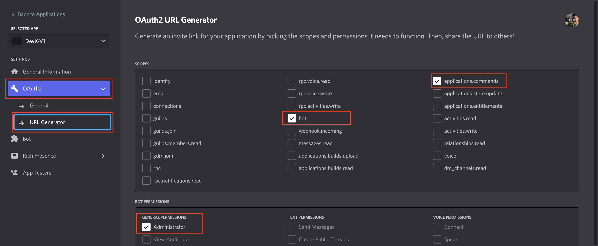
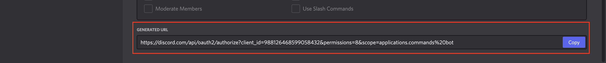
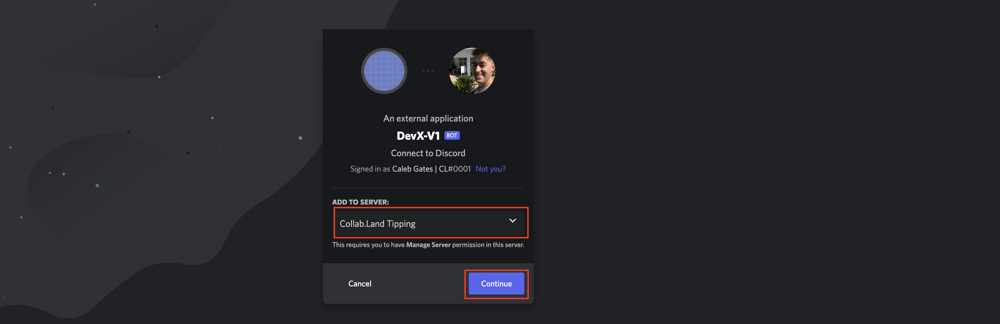
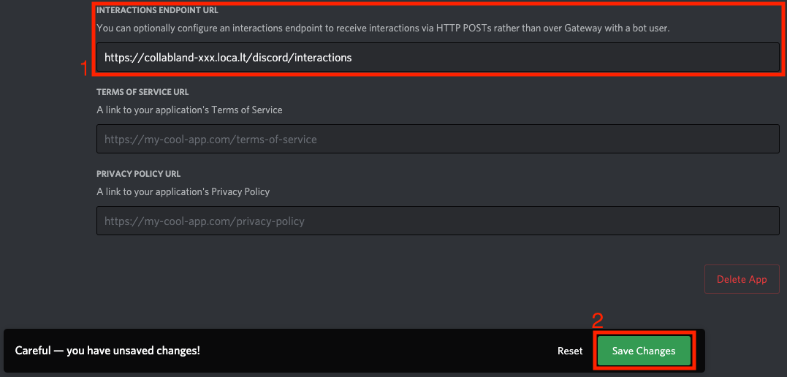

# Invite the Bot

## 1. Inviting the Bot To Your Guild

After obtaining your Discord’s application OAuth 2 Client ID, you can follow the instructions on the following link by replacing the `<CLIENT_ID>` parameter.

`https://discord.com/api/oauth2/authorize?client_id=<CLIENT_ID>&permissions=8&scope=applications.commands%20bot`

You can also generate the url on the OAuth2 URL Generator Tab by selecting the scopes `bot` and `application.commands` and the bot permission `Administrator`





Paste your link into a browser and select a server to add your bot to.




## 2. Find and Add local tunnel to Discord

Discord Interactions are necessary for some functionality of the bot like the join button in the `collabland-join` channel

In order to enable that feature you `api-server` will need to be available publicly online

<aside>
💻 You can do so in local instance by adding the `—-local-tunnel` flag to the start script.
`node --enable-source-maps . --local-tunnel`
This will output on the console the following line indicating the public URL
`Local tunnel is started at https://collabland-xxx.loca.lt`

</aside>

**To find your URL**

1. Go to the terminal where you started the API server
2. CTRL-F search for “https://collabland-"
3. Copy the complete url you find in your terminal logging

**You will need to setup the public URL on the Discord’s developer portal**

1. Head to the [https://discord.com/developers/applications](https://discord.com/developers/applications)
2. Select you application
3. Head to the “General Information” menu item on the side bar (if not already)
4. On the field listed as “INTERACTIONS ENDPOINT URL” enter you public’s instance URL and discord’s interaction path (e.g. `https://collabland-xxx.loca.lt/discord/interactions`)

   

   “INTERACTIONS ENDPOINT URL” field in “General Information” application page

Note: Discord will only let you save the Interaction Endpoint URL if that url is valid. Meaning discord will ping your URL when you click save to see if it gets a valid response. This means you must be running the api server when you go to save the url into discord. Otherwise discord will not save & will continue to tell you you have unsaved changed.

- Potential Errors
  1. AccessDeniedException: User: arn:aws:iam::220623082201:user/caleb is not authorized to perform: xray:PutTraceSegments because no identity-based policy allows the xray:PutTraceSegments action
     1. Its possible that my access keys do not have permission to post this. But it’s also not asking for my AWS credentials vault. Probably becasue .aws/credentials still exists so I will renamve the .aws/credentials dev to something else in the hope of triggering the AWS Vault.
  2. I changed the name of the [dev] credentials in .aws/credentials and now when I go to start the api server I get `Cannot start the application. CredentialsProviderError: Could not load credentials from any providers`
     1. So it’s not picking up my aws vault credentials. Maybe I truely need to change the name of the `credentials` file so that it doenst look there at all and is forced to check the vault?
     2. Well that didnt work.
     3. All I can think is that I’m failing to login with `aws-vault login dev` so I need to get that to work before I can even hope that my code can use those credentials
  3. BLOCKED: Can not deploy the slash command if cannot update the interaction URL & Cannot update that url if cannot start the api server, and cannot start the api server if AWS credentials are invalid

     1. Cannot start the application. AccessDeniedException: Access to KMS is not allowed
        at deserializeAws_json1_1GetSecretValueCommandError (/Users/calebgates/WebstormProjects/CollabLand/dev-x-test-1/collabland-monorepo-dev-x-test-1/node_modules/@aws-sdk/client-secrets-manager/dist-cjs/protocols/Aws_json1_1.js:596:24)
     2. Error: Dev Support needs to add user to KMS (should be done during onboarding)
     3. Sharing KMS with every team is not sustainable in the long run. Need to have a way for users to overwrite all secrets with ENV variables. For the time being add new users to KMS QA and KMS [What ever the team infra has been named ex. caleb-dev]
     4. TODO: Make a section on how to over ride these if needed in the future.
        Q: what are the very minimum variables to get started?
     5. This is an insane and blocking number of values for a new dev to get started. KMS is a good onboarding for now.

     ```bash
     * JSON data
     {
       "AIRTABLE_API_KEY": "***",
       "AIRTABLE_JOB_ERROR_REPORT": "***",
       "AIRTABLE_WALLET_RESETS_REPORT": "***",
       "ALCHEMY_API_KEY": "***",
       "ALCHEMY_POLYGON_API_KEY": "***",
       "ALCHEMY_FLOW_API_KEY_PROD": "***",
       "ALCHEMY_FLOW_API_KEY_QA": "***",
       "ALGORAND_API_KEY": "***",
       "AXIE_INFINITY_JWT_SECRET": "***",
       "COINBASE_CLIENT_ID": "***",
       "COINBASE_CLIENT_SECRET": "***",
       "COLLABLAND_GITHUB_APP": {
         "appId": "***",
         "privateKey": "***",
         "secret": "***",
         "clientId": "***",
         "clientSecret": "***"
       },
       "COLLABLAND_JWT_PRIVATE_KEY": "***",
       "COLLABLAND_JWT_PUBLIC_KEY": "***",
       "COLLABLAND_JWT_SECRET": "***",
       "COLLABLAND_MINTER_PRIVATE_KEY": "***",
       "COLLABLAND_METRICS_USERNAME": "***",
       "COLLABLAND_METRICS_PASSWORD": "***",
       "COLLABLAND_NFT_DROP_CONTRACT_ADDRESS": "***",
       "COLLABLAND_NFT_DROP_MINTER_PRIVATE_KEY": "***",
       "COLLABLAND_SUPPORT_TEAM": [
         {"platform": "***", "id": "***"},
         {"platform": "***", "id": "***"}
       ],
       "COLLABLAND_TIP_JAR_PRIVATE_KEY": "***",
       "DAPPER_CLIENT_ID": "***",
       "DAPPER_CLIENT_SECRET": "***",
       "DISCORD_BOT_TOKEN": "***",
       "DISCORD_CLIENT_ID": "***",
       "DISCORD_CLIENT_SECRET": "***",
       "DISCORD_PUBLIC_KEY": "***",
       "ELUVIO_CLIENT_ID": "***",
       "ELUVIO_CLIENT_SECRET": "***",
       "ETHERSCAN_API_KEY": "***",
       "ETHPLORER_API_KEY": "***",
       "FLOW_NETWORK": "***",
       "GITHUB_CLIENT_ID": "***",
       "GITHUB_CLIENT_SECRET": "***",
       "INFURA_PROJECT_ID": "***",
       "INFURA_PROJECT_SECRET": "***",
       "INSTAGRAM_CLIENT_ID": "***",
       "INSTAGRAM_CLIENT_SECRET": "***",
       "KCHANNEL_TEST_RECEIVER_MNEMONIC": "***",
       "KCHANNEL_TEST_SENDER_MNEMONIC": "***",
       "MAGIC_LINK_SECRET_API_KEY": "***",
       "MORALIS_API_KEY": "***",
       "NEAR_MINTER_ACCOUNTS": [
         {
           "account_id": "***",
           "private_key": "***"
         },
         {
           "account_id": "***",
           "tenant_id": "***",
           "private_key": "***"
         },
         {
           "account_id": "***",
           "private_key": "***",
           "sponsored_amount": 0.1
         }
       ],
       "NEAR_TESTNET_ACCOUNT_ID": "***",
       "NEAR_TESTNET_ACCOUNT_PRIVATE_KEY": "***",
       "NEAR_TIPPING_CONFIG": {
         "contractId": "***",
         "publicKey": "***",
         "privateKey": "***",
         "ethereumPrivateKey": "***"
       },
       "NIFTY_CLIENT_ID": "***",
       "NIFTY_CLIENT_SECRET": "***",
       "OPENSEA_API_KEY": "***",
       "OPEN_SEARCH_DOMAIN": "***",
       "OREID_API_KEY": "***",
       "OREID_APP_ID": "***",
       "POCKET_APPLICATION_KEY": "***",
       "PRIVY_API_KEY": "***",
       "PRIVY_API_SECRET": "***",
       "PROMETHEUS_PUSH_GATEWAY": "***",
       "REDDIT_BOT_APP_ID_COLLABLAND": "***",
       "REDDIT_BOT_APP_SECRET_COLLABLAND": "***",
       "REDIS_HOST": "***",
       "REDIS_PASSWORD": "***",
       "REDIS_PORT": 6379,
       "REDIS_USERNAME": "***",
       "ROLL_REFRESH_TOKEN": "***",
       "SLACK_CLIENT_ID": "***",
       "SLACK_CLIENT_SECRET": "***",
       "SLACK_SIGNING_SECRET": "***",
       "SOLANA_RPC_URL": "***",
       "STRIPE_API_KEY": "***",
       "STRIPE_SIGNING_SECRET": "***",
       "TELEGRAM_BOT_NAME": "***",
       "TELEGRAM_BOT_TOKEN": "***",
       "TEZOS_SECRET_KEY": "***",
       "TWITTER_CONSUMER_KEY": "***",
       "TWITTER_CONSUMER_SECRET": "***",
       "VERAMO_AGENT_URL": "***",
       "VERAMO_API_KEY": "***"
     }
     ```

  4. BUG
     Describing index keys for [ 'collabland-table-caleb-dev', 'collabland-api-table-caleb-dev' ] +2s
     Cannot start the application. ResourceNotFoundException: Requested resource not found: Table: collabland-table-caleb-dev not found
     at deserializeAws_json1_0ResourceNotFoundExceptionResponse (/Users/calebgates/WebstormProjects/CollabLand/dev-x-test-1/collabland-monorepo-dev-x-test-1/node_modules/@aws-sdk/client-dynamodb/dist-cjs/protocols/Aws_json1_0.js:3036:23) 1. Tarmac team needs to rebuild caleb-dev infrastructure because it was created on an old version
