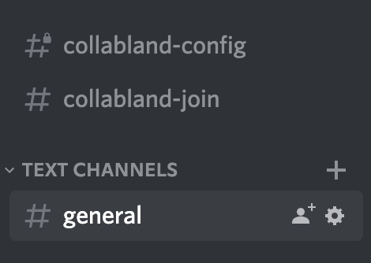

# Invite the Bot

## 1. Inviting the Bot To Your Guild

After obtaining your Discord’s application OAuth 2 Client ID, you can follow the instructions on the following link by replacing the `<CLIENT_ID>` parameter.

`https://discord.com/api/oauth2/authorize?client_id=<CLIENT_ID>&permissions=8&scope=applications.commands%20bot`

You can also generate the url on the OAuth2 URL Generator Tab by selecting the scopes `bot` and `application.commands` and the bot permission `Administrator`

Paste your link into a browser and select a server to add your bot to.

## 2. Find and Add local tunnel to Discord

Discord Interactions are necessary for some functionality of the bot like the join button in the `collabland-join` channel

In order to enable that feature you `api-server` will need to be available publicly online

local tunnel is by default used in start script. Just in case local tunnel doesn't work (sometimes server is down) one can also use ngrok (this option is also there in start script). Problem with ngrok is that it always gives you new URL after every start. So you always have to update discord interaction url as explained below.

**To find your URL**

1. Go to the terminal where you started the API server
2. CTRL-F search for “https://collabland-"
3. Copy the complete url you find in your terminal logging

**You will need to setup the public URL on the Discord’s developer portal**

1. Head to the [https://discord.com/developers/applications](https://discord.com/developers/applications)
2. Select you application
3. Head to the “General Information” menu item on the side bar (if not already)
4. On the field listed as “INTERACTIONS ENDPOINT URL” enter you public’s instance URL and discord’s interaction path (e.g. `https://collabland-xxx.loca.lt/discord/interactions`)

   

   “INTERACTIONS ENDPOINT URL” field in “General Information” application page

Note: Discord will only let you save the Interaction Endpoint URL if that url is valid. Meaning discord will ping your URL when you click save to see if it gets a valid response. This means you must be running the api server when you go to save the url into discord. Otherwise discord will not save & will continue to tell you you have unsaved changed.

## Validate the Bot invitation

In order to validate the link between the discord bot and our local setup, we should see 2 new channels created in the invited server.

After the Discord bot have been added to the guild, the bot should automatically create 2 channels (`collabland-config` , `collabland-join`)

Channel list after the bot have joined
