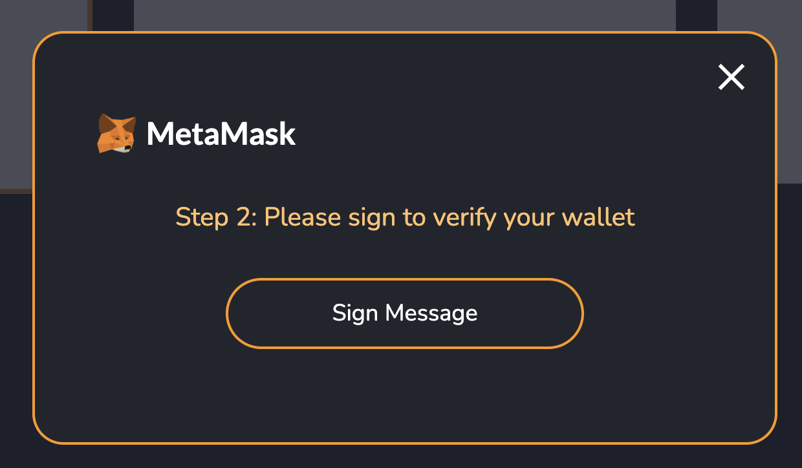
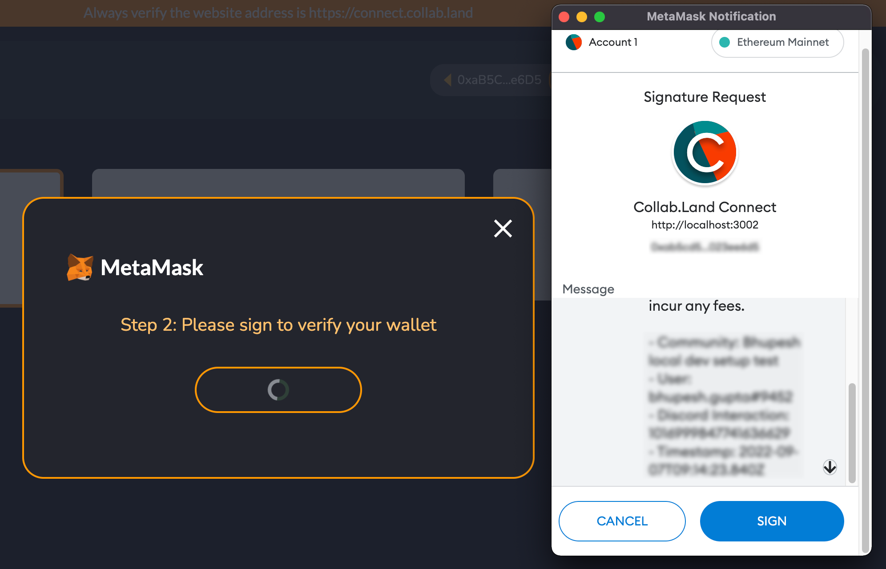
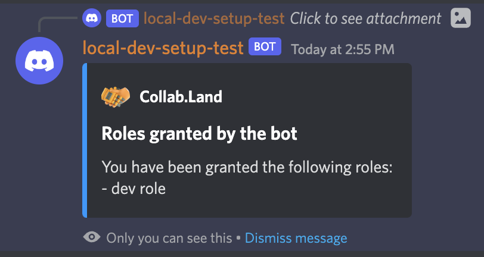

# Joining a Channel

## Click the Lets Go button
First of all go to the server and then to **`#collabland-join`** channel and then hit the **`Let's Go`** button.

When you hit the **`Let's Go`** button it will give you a message asking you to **`Connect Wallet`**

## Connect Wallet
Clicking the Connect Wallet button will take you to you wallet connect UI page. Here it shows various providers from where you can connect the wallet.

Now this is a prerequisite that you must have a wallet created on one of these providers and ask Collab Land team to send you minimum amount of tokens to join the community (generally one token is enough).

For e.g. we select MetaMask as an option then it will ask to sign message to verify your wallet.

It opens up the MetaMask browser extension (one need this also as a prerequisite) and ask to sign the message.

After clicking Sign wallet will be connected and a success page will appear.

Now close this page and go back to your Discord server there you will find a bot message stating which role has been assigned to you.

## Setup Completed
This completes the whole Discord flow with setup on local development environment. If found something not working or any other support OR if there is any other feedback on documentation please feel free to reach out to the Collabland team.
