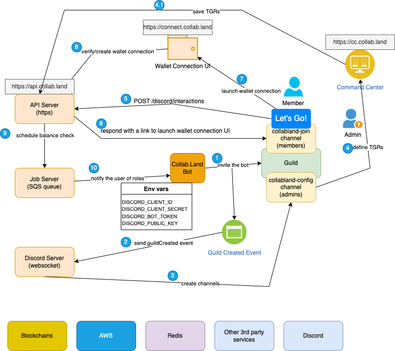

# Local Development Overview

# Local Developer Setup Diagram

In this section we will walk you through the steps to setup the local development environment for discord bot flow.

The diagram below shows a detailed overview of the flow which should be running successfully once the development environment is setup.

The bottom boxes in the image are some external dependencies, some of which we will be needed to setup as part of local development environment.

You will need certain credentials and accesses to setup services like aws-vault, clone github repos etc. So make sure to have those from collab land team before one can start with the next steps.
