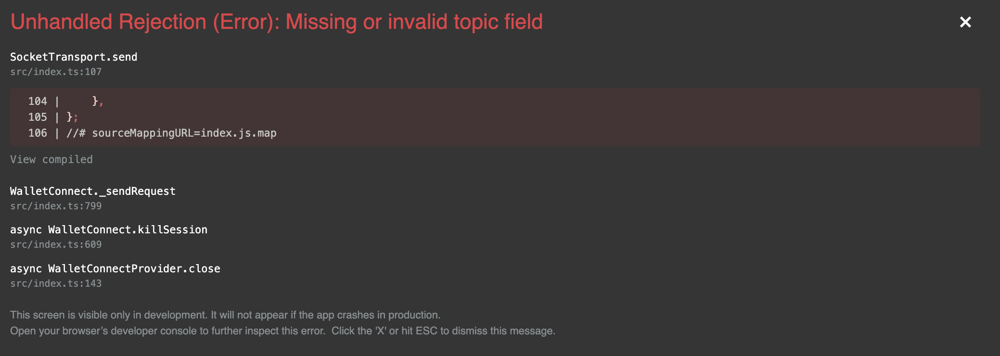

# CollabLand-Connect

## Set up Node.js and Yarn

1. Install `nvm`

   Please follow instructions at
   <https://github.com/nvm-sh/nvm#installing-and-updating> to install `nvm` so
   that we can easily switch between different node versions.

2. Install `node`

   With `nvm`, let's install Node.js 14 as the default version:

   ```sh
   nvm install 14
   ```

3. install yarn

   ```sh
   npm install -g yarn
   ```

4. Verify `node` and `yarn`

   You can use the command below to verify that Node.js 14.x and Yarn 1.22.x are
   installed.

   ```sh
   node -v
   yarn -v
   ```

   It should print the version of `node` (such as `v14.x.x`) and `yarn` (such as
   `1.22.17`).

## Check out source code from git

```sh
cd
mkdir Projects
cd Projects
git clone git@github.com:abridged/collabland-connect.git
```

## Install dependencies and bootstrap the project

```sh
cd collabland-connect
yarn install
```

```sh
yarn start
```

Runs the app in the development mode.
Open [http://localhost:3000](http://localhost:3000) to view it in the browser.

The page will reload if you make edits.
You will also see any lint errors in the console.

```sh
yarn build
```

Builds the app for production to the `build` folder.
It correctly bundles React in production mode and optimizes the build for the best performance.

The build is minified and the filenames include the hashes.
Your app is ready to be deployed!

## Apple M1 Dependency
This repo has a hard dependency of node version 14. Due to certain dependencies it doesn't work on node version 16. And the native support for M1 apple silicon hardware came natively into node 16 only. So when we try do `yarn install` with node 16 the **wrtc** package fails to compile (an internal dependency). So we will need to install rosetta and do this install with that. Please follow this link [M1 issues with node version](https://dev.to/ibrarturi/how-to-fix-m1-mac-issue-with-installing-node-versions-30ah).

## Environment Variables
Set the api server url in the environment variable of wallet connect repo. Also one need to create account on [Infura](https://infura.io/) and get API key from there which needs to be setup as part of env variable on this repo.

start-react.sh

```bash
#REACT_APP_BITSKI_CLIENT_ID=
REACT_APP_IS_DEBUG=false
REACT_APP_INFURA_ID=1a28be2ff97d45hj8145e1ll4c1fghj7
REACT_APP_API_SERVER_URL=https://collabland-calebgates.loca.lt
export PORT=3001

npm run start
```


If all good then wallet connection UI will come up but with one error which is just on local and can be ignored.



Just cross this error and main UI will load.


## Possible errors & solutions in building the project:

- missing node-pre-gyp
- Memory Limitations when building collab-connect
- Arm vs Intel OS architecture (M1 specific issue)
- AWS Amplify deployment issue


```bash
git clone git@github.com:abridged/collabland-connect.git
cd collabland-connect

```

### Error 1

```bash
## Got an error for not having "node-pre-gyp"
npm install -g node-pre-gyp
npm install

npm run build
```

### Error 2

Failing to build - ram error? Using mac with only 8 gigs of ram (thank goodness for M1 Max 64gb Ram)

```bash
Creating an optimized production build...
=============

WARNING: You are currently running a version of TypeScript which is not officially supported by @typescript-eslint/typescript-estree.

You may find that it works just fine, or you may not.

SUPPORTED TYPESCRIPT VERSIONS: >=3.3.1 <4.2.0

YOUR TYPESCRIPT VERSION: 4.6.4

Please only submit bug reports when using the officially supported version.

=============

<--- Last few GCs --->

[18120:0x1049e0000]   174259 ms: Mark-sweep (reduce) 2038.8 (2051.5) -> 2036.9 (2055.3) MB, 1530.2 / 0.1 ms  (+ 0.1 ms in 251 steps since start of marking, biggest step 0.0 ms, walltime since start of marking 1647 ms) (average mu = 0.260, current mu = 0.2[18120:0x1049e0000]   176812 ms: Mark-sweep (reduce) 2039.9 (2055.2) -> 2038.4 (2054.2) MB, 2541.7 / 0.1 ms  (average mu = 0.126, current mu = 0.005) allocation failure scavenge might not succeed

<--- JS stacktrace --->

FATAL ERROR: Ineffective mark-compacts near heap limit Allocation failed - JavaScript heap out of memory
 1: 0x101306bb5 node::Abort() (.cold.1) [/usr/local/bin/node]
 2: 0x1000ad6c9 node::Abort() [/usr/local/bin/node]
 3: 0x1000ad82f node::OnFatalError(char const*, char const*) [/usr/local/bin/node]
 4: 0x1001f1b97 v8::Utils::ReportOOMFailure(v8::internal::Isolate*, char const*, bool) [/usr/local/bin/node]
 5: 0x1001f1b33 v8::internal::V8::FatalProcessOutOfMemory(v8::internal::Isolate*, char const*, bool) [/usr/local/bin/node]
 6: 0x10039f695 v8::internal::Heap::FatalProcessOutOfMemory(char const*) [/usr/local/bin/node]
 7: 0x1003a113a v8::internal::Heap::RecomputeLimits(v8::internal::GarbageCollector) [/usr/local/bin/node]
 8: 0x10039c865 v8::internal::Heap::PerformGarbageCollection(v8::internal::GarbageCollector, v8::GCCallbackFlags) [/usr/local/bin/node]
 9: 0x10039a190 v8::internal::Heap::CollectGarbage(v8::internal::AllocationSpace, v8::internal::GarbageCollectionReason, v8::GCCallbackFlags) [/usr/local/bin/node]
10: 0x1003a88ba v8::internal::Heap::AllocateRawWithLightRetrySlowPath(int, v8::internal::AllocationType, v8::internal::AllocationOrigin, v8::internal::AllocationAlignment) [/usr/local/bin/node]
11: 0x1003a8941 v8::internal::Heap::AllocateRawWithRetryOrFailSlowPath(int, v8::internal::AllocationType, v8::internal::AllocationOrigin, v8::internal::AllocationAlignment) [/usr/local/bin/node]
12: 0x100376712 v8::internal::Factory::NewFillerObject(int, bool, v8::internal::AllocationType, v8::internal::AllocationOrigin) [/usr/local/bin/node]
13: 0x1006f64c8 v8::internal::Runtime_AllocateInYoungGeneration(int, unsigned long*, v8::internal::Isolate*) [/usr/local/bin/node]
14: 0x100a7c3f9 Builtins_CEntry_Return1_DontSaveFPRegs_ArgvOnStack_NoBuiltinExit [/usr/local/bin/node]
15: 0x2b841fb76cf7
```

To fix this error, you need to update the maximum heap size in node using the following cmd:

```jsx
export NODE_OPTIONS="--max-old-space-size=8192"
```

```jsx
node -e 'console.log(v8.getHeapStatistics().heap_size_limit/(1024*1024))'
```

[https://stackoverflow.com/questions/53230823/fatal-error-ineffective-mark-compacts-near-heap-limit-allocation-failed-javas](https://stackoverflow.com/questions/53230823/fatal-error-ineffective-mark-compacts-near-heap-limit-allocation-failed-javas)

### Error 3

#### Arm vs Intel

Please follow this link [M1 issues with node version](https://dev.to/ibrarturi/how-to-fix-m1-mac-issue-with-installing-node-versions-30ah) to fix the issue.

### Error 4

#### AWS Amplify deployment issue

```jsx
Failed to compile.
Failed to minify the bundle. Error: static/js/2.011c9943.chunk.js from Terser
Error: Call retries were exceeded
at /codebuild/output/src089568832/src/collabland-connect/node_modules/react-scripts/scripts/build.js:188:23
at finalCallback (/codebuild/output/src089568832/src/collabland-connect/node_modules/webpack/lib/Compiler.js:257:39)
at /codebuild/output/src089568832/src/collabland-connect/node_modules/webpack/lib/Compiler.js:273:13
```

Solution:

Install dev dependency `yarn add terser -D`
