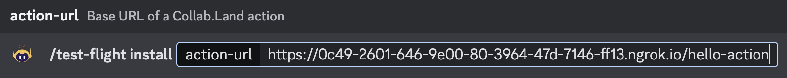

**Collab.Land Actions** is a set of tools for building and testing custom actions for Discord interactions. With Collab.Land Actions, the setup and configuration of the Collab.Land infrastructure, including Docker, AWS, authentications and securities, are handled for you by default.

To get started, use any of the `hello-action` templates we provide on GitHub:

1. [Loopback hello-action template](https://github.com/abridged/collabland-hello-action/).
2. [Express hello-action template](https://github.com/abridged/collabland-action-express). 

The templates provide a basic structure for building custom actions on top of the Collab.Land engine. Once your custom action is built, it can be run on a TestFlight mini-app within the Collab.Land QA bot to execute the business logic you've developed.

You can install the action on your Discord server and test your implementation end to end without any oversight or dependency on Collab.Land. This allows for efficient contribution and extension to Collab.Land without the overhead of manual setup.

# Getting Started

This guide will walk you through the process of setting up and testing your first action using the `hello-action` template.

## Prerequisites

- Node.js and npm (Node Package Manager) must be installed on your system.

## Using the hello-action template

1. Fork the `hello-action` [template repository](https://github.com/abridged/collabland-hello-action/) from GitHub.
2. Clone the project.

```bash
git clone [PROJECT_URL.git]
```

3. Navigate to the project directory and install the project dependencies.

```bash
cd collabland-hello-action
npm install
```

4. Build the project

```bash
npm run build
```

## Run hello-action with Collab.Land QA bot

To run the server for Collab.Land QA bot:

1. Fetch action public keys for Collab.Land QA

Open https://api-qa.collab.land/config from your browser:

```json
{
  "actionEcdsaPublicKey": "0x043b30458cf281461de368fd591b4c9b511a1b9263cea48517f41217ba14aa714fefea1adcfc9d8ae7ec0b4f7272f472178a5e674a1229ce5d2f2526244d62fbd8",
  "actionEd25519PublicKey": "DhF7T98EBmH1ZFmdGJvBhkmdn3BfAqc3tz8LxER8VH2q"
}
```

2. Download and install `ngrok` from https://ngrok.com/download

3. Run hello-action server

   ```sh
   npm run server -- DhF7T98EBmH1ZFmdGJvBhkmdn3BfAqc3tz8LxER8VH2q
   ```

   From a different terminal window:

   ```sh
   ngrok http 3000
   ```

4. Copy the `https` URL, for example (yours will be **different**):

   ```
   https://0c49-2601-646-9e00-80-3964-47d-7146-ff13.ngrok.io/
   ```

   Append `/hello-action` to get the full URL. For example: `https://0c49-2601-646-9e00-80-3964-47d-7146-ff13.ngrok.io/hello-action`

5. Follow instructions below to test your action with Collab.Land QA bot.

## Setting Up the TestFlight Mini-App on Discord

This guide will walk you through the steps of installing and setting up the Collab.Land TestFlight mini-app to test your actions on a Discord server.

### Prerequisites

- A Discord account
- A Discord server to install and test the mini-app

### Installing the Collab.Land QA Bot on Discord

1. Sign in to Discord or [create a test Discord server.](https://support.discord.com/hc/en-us/articles/204849977-How-do-I-create-a-server-)
2. [Invite the QA Bot](https://api-qa.collab.land/discord/bot-invite) to your server where you would like to run your `action`.


1. Grant the required permissions:


Upon Authorization, you will be redirected to the Command Center. It is a password-protected site with:

- Username: `collabland`
- Password: `nft1024`

To access the Command Center again, go to: [https://cc-qa.collab.land](https://cc-qa.collab.land)

### Creating a Community Wallet

<!-- why do they need to create a community wallet? -->

1. In the Command Center, go to the Marketplace tab.
2. Click on the "Create community wallet" button.
3. You will receive a message saying "Wallet successfully created” and access to the marketplace apps.


### Installing the TestFlight Mini-App

1. In the Marketplace tab, you will see all the available mini-apps, including `Test Flight`.
2. Click on the "Install" button for the Test Flight app.
3. The mini-app modal will pop up for you, click "Free Install" to install the app.


### Setting up the TestFlight Mini-App on Discord

Go to the Discord server in which you installed the [Collab.Land](https://Collab.Land) QA bot and type `/test` to see all the newly installed slash commands that are made available through the “Test Flight” mini app.


Select the `/test-flight install` option and enter your public action URL you created earlier using nfgrok in the `action-url` field. For example, here we entered: [https://0c49-2601-646-9e00-80-3964-47d-7146-ff13.ngrok.io/hello-action](https://0c49-2601-646-9e00-80-3964-47d-7146-ff13.ngrok.io/hello-action)



You will get a message with a description of the `action` that you are about to install. Click the “Install the action” button. You will get a confirmation that the “action is installed”.


You and your users can now start using your `action` in the Discord server by running your slash commands!

To customize this action and test it locally, follow this [guide](./test-locally.md).

<!-- For example, here `/hello-action` command is installed -->

<!-- %20on%20Collab%20L%209ed73b509b4b4a459c8c901b4640c01a/Untitled%207.png>)

%20on%20Collab%20L%209ed73b509b4b4a459c8c901b4640c01a/Untitled%208.png>)

%20on%20Collab%20L%209ed73b509b4b4a459c8c901b4640c01a/Untitled%209.png>)

%20on%20Collab%20L%209ed73b509b4b4a459c8c901b4640c01a/Untitled%2010.png>) -->

<!-- The above example shows a Hello World version of what you can do with Collab Actions. Here, once you enter `/hello-action your-name <NAME>`, you first get a “Hello, `<NAME>`!” Greeting message, then showing if your action needs any user permissions, you can list it and the user will have the option to approve or deny it. There is a 3rd follow-up message with a counter of 5 seconds and it disappears after that. This is all just to show what’s possible with Actions! -->

<!-- Please also note that in the above example, all the messages are [ephemeral messages](https://www.notion.so/Discord-Guest-Pass-29d94871d6cf4003ada2b80e258b15e8), you can also make your follow-up message(s) public if needed! -->
