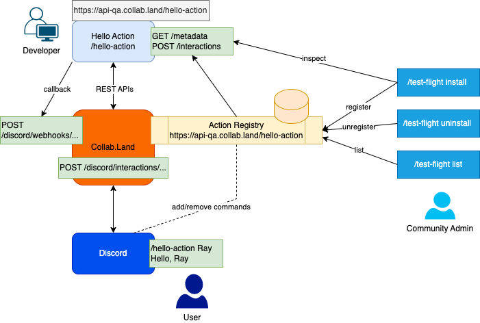

Collab Actions is a simple REST API endpoint for building custom Actions for Discord interactions. We recommend using the [hello-action template](../collab-actions/getting-started-with-collab-actions) for contributing mini-apps to Collab.Land. However, if you want to build your own custom actions, you can do that by building and exposing the `/metadata` and `/interactions` endpoints to Collab.Land.



## Building your /metadata endpoint

### GET `/metadata`

This API should return your mini-apps metadata. [Collab.Land](https://Collab.Land) will call the endpoint to fetch the details of your mini-app for audit and operational purposes. It should return a `metadata` result containing your apps `manifest`, `supportedInteractions` and `applicationCommands` in the format outlined below:

```jsx
interface Metadata {
  // Manifest for defining mini-app metadata
  manifest: MiniAppManifest;

  // A list of all the supported interactions on your app
  supportedInteractions: {
    type: InteractionType,
    names: ["hello-action"],
  };

  // All the application commands that will be used
  applicationCommands: ApplicationCommand;
}
```

### manifest

The `manifest` is a model that defines the details of the miniapp. It has the following structure:

```jsx
type Thumbnail = {
  label: string;
  src: string;
  sizes: string;
};

type Icon = {
  label: string;
  src: string;
  sizes: string;
};
interface MiniAppManifest {
// Unique Id for Mini App
 appId: string;

// The developer for the Mini App
 developer: string;

// Name for the Mini App
 name: string;

// Short Name for the Mini App
 shortName: string;

// Release date
 releasedDate?: number;

// Version of miniapp
 version?:{name:’1.0.0’};

// Keywords for the search
 keywords?: string[];

// Tags
 tags?: string[];

// Website url of the mini app docs or homepage
 website?: string;

// Short Description of the mini app which will reflect on listing page
 shortDescription?: string;

// This can be markdown or docs for what Mini App can do and what is it for? Be elaborate as needed.
 description?: string;

// Currently only discord for now
 platforms?: [‘discord’];

// thumbnail URL for your miniapp
 thumbnails?: Thumbnail[];

// icon URL for your miniapp
 icons?: Icon[];
}
```

An example implementation for the mini-app manifest:

```jsx
 manifest: new MiniAppManifest({
   appId: 'hello-action',
   developer: 'collab.land',
   name: 'HelloAction',
   platforms: ['discord'],
   shortName: 'hello-action',
   version: {name: '0.0.1'},
   website: 'https://collab.land',
   description: 'A long description of your miniapp for the overview page',
   shortDescription: 'a short description of your miniapp for the miniapp cards',
   thumbnails: [
      {
        label: 'Member Directory',
        src: 'thumbnail url',
        sizes: '40x40',
      },
      {
        label: 'Overview',
        src: 'thumbnail url here',
        sizes: '40x40',
      }
    ],

  icons: [
      {
        label: 'App icon',
        src: 'App icon URL here',
        sizes: '40x40',
      },
    ],
}),
```

### supportedInteractions

`supportedInteractions` is an array of supported interactions, with the following structure:

```jsx
supportedInteractions:{
 // this will handle the `/hello-action` slash command
 type: InteractionType,
 names: ["hello-action"],
}
```

### applicationCommands

`applicationCommand` is a list of all the application commands that will be used, including metadata (name and short name). The structure of `applicationCommands` is:

```jsx
interface ApplicationCommand {
  metadata: {
    // metadata name for the command
    name: "HelloAction",
    // short metadata name for the command
    shortName: "hello-action",
  };

  // actual name of the command to be used in discord.
  name: "hello-action";
  type: ApplicationCommandType;

  // description of the command
  description: "/hello-action";

  // options for discord command as per [Discord documentation](https://discord.com/developers/docs/interactions/application-commands#application-command-object-application-command-option-structure)
  options: [
    {
      name: "your-name",
      description: "Name of person we're greeting",
      type: ApplicationCommandOptionType,
      required: true,
    }
  ];
}
```

## Building your `/interactions` endpoint

### POST `/interactions`

Collab.Land will receive interactions from Discord and forward them to your Action server through this endpoint. For security purposes, the payload requires signature verification using the ecdsa or Ed25519 algorithms, and verification is done using a public key.

<aside>
💡 Collab.Land utilizes signature verification for enhanced security measures. Although it is not a requirement, implementing this feature enhances the protection of the API and prevents both unauthorized access to, and potential attacks on, the server.

</aside>

## Signature Verification

To enhance the security of the API, Collab.Land implements signature verification. This feature prevents unauthorized access or potential attacks on the server. The following headers will be included in the payload for signature verification:

1. `X-Signature-Ecdsa` or `X-Signature-Ed25519` - Indicates the algorithm used to generate the public signing key by the Collab.Land server.
2. `X-Signature-Timestamp` - Timestamp of when the encryption was performed.

To verify the request payload, you need to parse the request body to a string format and verify it using the signing public key.

### How to verify the payload

1. The request body should be in a string format like `JSON.stringify()` in Javascript.
2. Create a variable named `payload` and concatenate `X-Signature-Timestamp` with the Stringified request body.
3. You can verify the signature using:
   1. `publickey` — You will receive this from your [Collab.Land Config](https://api-qa.collab.land/config).
   2. `body` — This is the payload from point 2.
   3. `signature` — You received in the request Header corresponding to the algorithm.

Here are some code implementations (in Javascript) you can leverage to verify signatures depending on the algorithm used:

## ECDSA

```jsx
const { utils } = require("ethers");
function verifyRequestWithEcdsa(publicKey, signature, body) {
  let verified = false;
  try {
    console.log("Verifying webhook request with Ecdsa signature...");
    console.log(
      "Public key: %s, signature: %s, message: %s",
      publicKey,
      signature,
      body
    );
    const digest = utils.hashMessage(body);
    verified =
      signature != null &&
      utils.recoverPublicKey(digest, signature) === publicKey;
    console.log("Signature verified: %s", verified);
  } catch (err) {
    console.log("Failed to verify signature: %O", err);
    verified = false;
  }

  if (!verified) {
    console.log("Invalid signature: %s, body: %s", signature, body);
    throw new Error("Invalid request - Ecdsa signature cannot be verified.");
  }
  return verified;
}
```

## ED25199

```jsx
const nacl = require("tweetnacl");
function verifyRequestWithEd25519(publicKey, signature, body) {
  let verified = false;
  try {
    console.log("Verifying webhook request with Ed25519 signature...");
    console.log(
      "Public key: %s, signature: %s, message: %s",
      publicKey,
      signature,
      body
    );
    verified =
      signature != null &&
      nacl.sign.detached.verify(
        Buffer.from(body, "utf-8"),
        Buffer.from(signature, "hex"),
        Buffer.from(publicKey, "hex")
      );
    console.log("Signature verified: %s", verified);
  } catch (err) {
    verified = false;
    console.log(err.message);
  }
  if (!verified) {
    throw new Err("Invalid request - Ed25519 signature cannot be verified.");
  }
  return verified;
}
```

## Response

After the security measures have been handled and the request has been processed, you can send responses back to Collab.Land using the [discord interaction API](https://discord.com/developers/docs/interactions/receiving-and-responding#responding-to-an-interaction) in the same way as you would send them to Discord.

## Handling Subsequent Interactions

The request body comes with a `callbackUrl` property that provides a channel for subsequent communication. With the `callbackUrl`, you can perform CRUD operations to `follow-up` `delete` or `update` messages.

- `POST` to the `callbackUrl` to send replies or responses to the initial interaction message.
- `PATCH` to `{callbackUrl}/messages/{messageId}` to update an old message.
- `DELETE` to `{callbackUrl}/messages/{messageId}` to delete a message, and
- `GET` to `{callbackUrl}/messages/{messageId}` to get a particular message.
