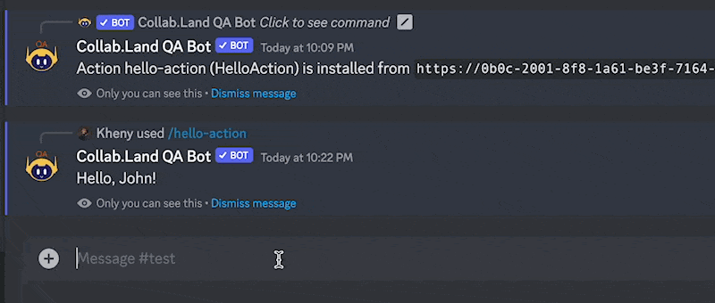

[In the previous section](/docs/upstream-integrations/collab-actions/getting-started-with-collab-actions), you learned how to get started with Collab Actions by installing the Express Action template and creating a basic "Hello, World!" Action. In this section, we'll take a step further and learn how to customize the Express Action template to implement your own business logic.

### Editing the response message

As an example, let's say you want to create a welcome message that greets new members in your Discord server. By default, the Express Action template responds with a simple "Hello, <your_name>" message. However, you can easily change this message to say something more personalized or relevant to your community.

To edit the response message, open the `src/routes/hello-action.ts` file in your favorite code editor. This file contains the main code for the Express Action template, including the `handle()` function that is responsible for processing incoming messages and sending a response.

The `handle()` function currently looks like this:

```jsx
async function handle(
  interaction: DiscordActionRequest<APIChatInputApplicationCommandInteraction>
): Promise<DiscordActionResponse> {

  const yourName = getCommandOptionValue(interaction, "your-name");
  const message = `Hello, ${
    yourName ?? interaction.user?.username ?? "World"
  }!`;
  const response: APIInteractionResponse = {
    type: InteractionResponseType.ChannelMessageWithSource,
    data: {
      content: message,
      flags: MessageFlags.Ephemeral,
    },
  };
```

This code creates a template string that concatenates the "Hello, " string with the value of `yourName` variable or the display name of the member who triggered the Action. To customize this message, simply replace the "Hello, " part with your own message. For example, you could change it to:

```jsx
async function handle(
  interaction: DiscordActionRequest<APIChatInputApplicationCommandInteraction>
): Promise<DiscordActionResponse> {

  const yourName = getCommandOptionValue(interaction, "your-name");
  const message = `Welcome to our community, ${
    yourName ?? interaction.user?.username ?? "World"
  }!`;
  const response: APIInteractionResponse = {
    type: InteractionResponseType.ChannelMessageWithSource,
    data: {
      content: message,
      flags: MessageFlags.Ephemeral,
    },
  };
```

This will create a message that says "Welcome to our community, <your_name>" instead of the default "Hello, <your_name>".

### Testing your changes

Once you've made your changes to the `hello-action.ts` file, save the file and rebuild your Express server by running the following command in your terminal:

```bash
npm run build && npm start
```

This will rebuild the Action and start the server on your local machine. You can now test your changes by using the `/hello-action` command in your test Discord server. The difference is that instead of receiving a "Hello, <your_name>" message, you should now receive a "Welcome to our community, <your_name>" message.



With this, you've successfully customized the Express Action template to implement your own logic. [In the next section](/docs/upstream-integrations/collab-actions/build-a-template-collab-action), we'll take a look at how to build your own custom Action and explore the other functions available in the Express Action template.

<!-- ### Run the Action server

To test your action locally, run the Action server using the following command:

```bash
npm run server
```

By default, the server will generate an ECDSA key for signature verification between the client (signing the request payload) and the server (verifying the signature of the request).

You can use the following commands to run the server with different types of keys:

```bash
npm run server -- ecdsa
```

or

```bash
npm run server -- ed25519
```

When the server is running, it will output the signing key (including ecdsa or ed25519) in the console:

```bash
Action signing key: ecdsa:<0x...>
Hello action is running at http://[::1]:3000
```

> Note that you will need to reinstall your Action if supported interactions are updated (command params, action path, etc.). You can reinstall the action following the instructions [here](/docs/upstream-integrations/collab-actions/getting-started-with-collab-actions#install-the-action-on-your-discord-server).

Next, [Test the updated Action in a Discord server](/docs/upstream-integrations/collab-actions/getting-started-with-collab-actions#test-the-actions-in-a-discord-server). -->

<!-- Copy this signing key and use it to run the Action test client.

## Running the Action test client

The test client simulates how Discord Collab.Land responses to your action command. You can check out the mocked interaction at `src/client.ts`. Run the Action test client, use the following command:

```bash
npm run client -- <server-signing-key>
```

You can verify the result from Discord interaction response logs.

Similarly, as your action getting complicated, don't forget to edit `src/client.ts` to include required params for testing your action. -->

<!-- ## Next Steps

You can now start building and testing your own custom actions. Let's take a closer look at how everything's putting together. The following are implementation breakdowns: -->
