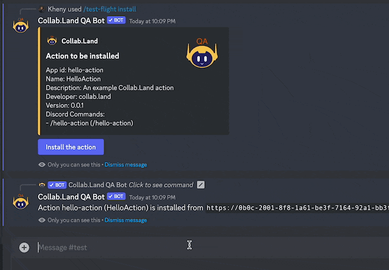

**Collab Actions** is a collection of tools designed to help create miniapps for the Collab.Land marketplace. By using Collab Actions, the setup and configuration of the Collab.Land infrastructure, which includes Docker, AWS, security measures, and authentication, is automatically managed for you.

### Collab.Land Action Templates

To get started, use any of the Collab Action templates we provide on GitHub:

1. [Express Action template](https://github.com/abridged/collabland-action-express)
2. [Loopback Action template](https://github.com/abridged/collabland-hello-action/)
3. [Python Action template](https://github.com/abridged/collabland-action-fastapi)

If you don't want to use a template, you can create your own Collab Action from scratch. Check out [Build a Custom Collab Action](/docs/upstream-integrations/collab-actions/build-a-custom-action) for detailed instructions.

### Collab.Land Action OSS Repositories

Take inspiration or learn from existing miniapps built with Collab Actions, check out the following repositories:

1. [ChainPatrol](https://github.com/chainpatrol/collab-action)
2. [Huddle01](https://github.com/Huddle01/collabland-huddle01-mini-app)
3. [Token Price](https://github.com/abridged/collabland-token-price-action)

<!-- The templates offer a basic framework for developing custom Actions using the Collab.Land engine. After building your custom Action, you can run it on a TestFlight mini-app within the Collab.Land QA bot to execute your business logic.

Once your Action is installed on your Discord server, you can test your implementation end-to-end without relying on Collab.Land. This approach streamlines the contribution and expansion of Collab.Land while eliminating the manual setup overhead.

The template repositories provide detailed information, such as how to run the Action locally, supported interaction types, and more.

This guide will walk you through the process of setting up and testing your first Collab Action using the Express Action template. -->

## Prerequisites

- Node.js and npm (Node Package Manager) must be installed on your system.

## Using a Collab Action template

1. [Fork the Action](https://github.com/abridged/collabland-action-express/fork).
2. Clone the project.

```bash
git clone [PROJECT_URL.git]
```

3. Navigate to the project directory and install the project dependencies.

```bash
cd collabland-action-express
npm install
```

4. Build the project

```bash
npm run build
```

## Run the Action server locally

To run the server, you'll need a public key for the Action. You can get the public key from the Collab.Land QA config endpoint by going to https://api-qa.collab.land/config from your browser:

```json
{
  "actionEcdsaPublicKey": "0x043b30458cf281461de368fd591b4c9b511a1b9263cea48517f41217ba14aa714fefea1adcfc9d8ae7ec0b4f7272f472178a5e674a1229ce5d2f2526244d62fbd8",
  "actionEd25519PublicKey": "DhF7T98EBmH1ZFmdGJvBhkmdn3BfAqc3tz8LxER8VH2q"
}
```

2. Download and install `ngrok` from https://ngrok.com/download.

3. Run the Action server:

   ```sh
   npm run server -- DhF7T98EBmH1ZFmdGJvBhkmdn3BfAqc3tz8LxER8VH2q
   ```

   This will start the server on port 3000. From a different terminal window, run `ngrok` on the same port to expose the server to other applications on the internet:

   ```sh
   ngrok http 3000
   ```

4. Copy the HTTPS URL, for example:

   ```
   https://0c49-2601-646-9e00-80-3964-47d-7146-ff13.ngrok.io/
   ```

> Your URL will be **different**.

To get the Action URL, append `/hello-action` to the end of the ngrok URL.
For example: *https://0c49-2601-646-9e00-80-3964-47d-7146-ff13.ngrok.io/hello-action*

Repeat the same process to get the Action URL for the other Action types:

- `/button-action` - Returns a button for users to interact with and
- `/popup-action` - Shows a pop up modal to the users for subsequent interactions.

## Test the Actions in a Discord server

With the Action server running, you can now test the Action in a Discord server using the Collab.Land QA bot. But first, you'll need to install the Collab.Land TestFlight mini-app on your Discord server. The steps are outlined below.

- [Create a test Discord server](#create-a-test-discord-server)
- [Install the Collab.Land QA bot on your Discord server](#install-the-collabland-qa-bot-on-discord)
- [Create a community wallet](#create-a-community-wallet)
- [Install the Collab.Land TestFlight mini-app on your Discord server](#install-the-testflight-mini-app)
- [Install the Action on your Discord server](#install-the-action-on-your-discord-server)
- [Test the Action](#test-the-action)

### Create a test Discord server

Follow the instructions on the Discord documentation to [create a test Discord server](https://support.discord.com/hc/en-us/articles/204849977-How-do-I-create-a-server-).

<!-- ## Setting Up the TestFlight Mini-App on Discord

This guide will walk you through the steps of installing and setting up the Collab.Land TestFlight mini-app to test your Actions on a Discord server.

### Prerequisites

- A Discord account
- A Discord server to install and test the Actions -->

### Install the Collab.Land QA Bot on Discord

1. Sign in to the Discord server where you would like to run your Action.
2. [Invite the QA Bot](https://api-qa.collab.land/discord/bot-invite) to your server.


3. Grant the required permissions:


Upon Authorization, you will be redirected to the Collab.Land Command Center. It is a password-protected site with the following credentials:

- Username: `collabland`
- Password: `nft1024`

To access the Command Center again, go to: [https://cc-qa.collab.land](https://cc-qa.collab.land)

### Create a Community Wallet

<!-- why do they need to create a community wallet? -->

1. In the Command Center, go to the Marketplace tab.
2. Click on the "Create community wallet" button.
3. You will receive a message saying "Wallet successfully created” and access to the marketplace apps.


### Install the TestFlight Mini-App

1. In the Marketplace tab, you will see all the available mini-apps, including `Test Flight`.
2. Click on the "Install" button for the Test Flight app.
3. The mini-app modal will pop up for you, click "Free Install" to install the app.


Go to the Discord server where you installed the Collab.Land QA bot and type `/test` to see all the newly installed slash commands that are made available through the “Test Flight” mini app.


### Install the Action on your Discord server

Select the `/test-flight install` command and enter the Action URL you created earlier using ngrok in the `action-url` field. For example, here we entered: [https://0c49-2601-646-9e00-80-3964-47d-7146-ff13.ngrok.io/hello-action](https://0c49-2601-646-9e00-80-3964-47d-7146-ff13.ngrok.io/hello-action) to test the `/hello-action` interaction.


You will get a message with a description of the Action that you are about to install. Click the “Install the action” button. You will get a confirmation that the “action is installed”.


### Test the Action

You and your users can now use the Action in the Discord server by running your slash commands!



To customize this Action and test it locally, follow this [guide](customize-collab-actions).
