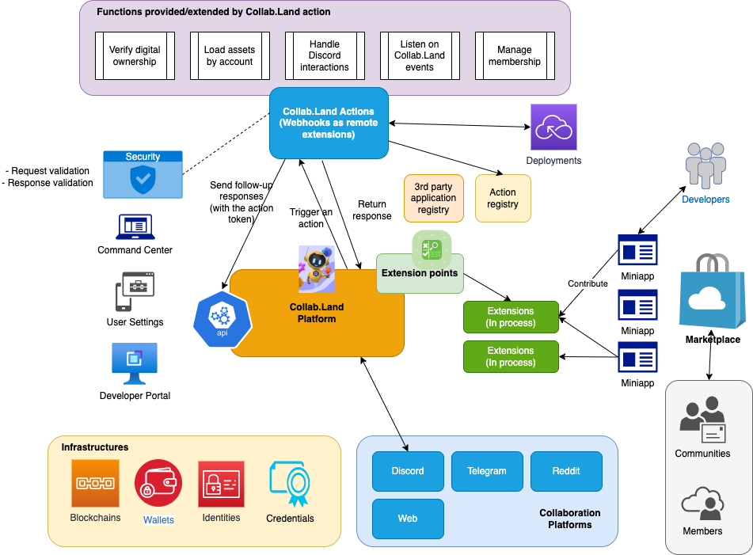

# Collab Actions

Collab.Land is launching a marketplace for Web3 developers and communities. Collab Actions is a tool for contributing apps to this marketplace. Developers can get started with Collab Actions by following the instructions provided in the [Getting Started with Collab Actions](https://dev.collab.land/docs/upstream-integrations/collab-actions/getting-started-with-collab-actions) guide.

## Why a Marketplace?

The Web3 ecosystem is hungry for user adoption, and tokenized communities and crypto users demand meaningful features from native platforms such as Discord, Telegram, and Reddit for simpler onboarding and engagement. A decentralized marketplace with distribution channels can connect Web3 applications with the right users.

## Why Collab.Land?

- Collab.Land serves over 50,000 tokenized communities with more than 2 million users and 8 million verified wallets. This provides a massive user base for developers to target and enlist their apps.
- Our APIs are highly extensible and supports multiple wallet providers, blockchain networks, and digital assets making it possible for an ecosystem of builders to emerge.
- Collab.Land also allows developers to control the development / deployment process and provides an easy-to-use `/test-flight` feature for testing in development.

## MiniApps

The Apps you develop to list on the Collab.Land marketplace are called miniapps. These miniapps can be developed in one of two ways:

- Via the Colla.Land Code base
- Via Collab Actions.

## Build MiniApps via the codebase

This is a legacy approach that we no longer recommend. It introduces the infrastructural overhead of cloning the Collab.Land codebase, setting up locally which could take a considerable amount of time and handling other extras like AWS, security, and auth by yourself.

## Build MiniApps via Collab.Land Actions

This is the recommended approach that allows you to build on top existing Action templates with all the underlying infrastruce and security concerns built-in.

- No need to access Collab.Land code base
- No need to provision AWS accounts/resources for development
- The actions are REST API-based and have isolation between the action logic and Collab.Land runtime
- Developers control the development and deployment flow
- Easily test Actions with `/test-flight`.

## Architecture



## What kinds of Actions can you build?

- Discord UIs
- Token gating rules
- User profiles
- Community management

## Build Actions for Discord commands

Developers can build Actions for Discord commands such as slash commands, popup commands, and message components like buttons, modals, and select menus.

- Slash commands
- Popup commands (user/message)
- Message components
  - Button
  - Modal
  - Select menu

## Examples and Resources

We have three example Collab Action templates for you to consider:

- [Loopback Hello Action template](https://github.com/abridged/collabland-hello-action)

- [Express Action template](https://github.com/abridged/collabland-action-express)
- [Python Action template](https://github.com/abridged/collabland-action-fastapi)

Learn more about building miniapps with Collab Actions [here](/docs/upstream-integrations/collab-actions/getting-started-with-collab-actions)

```mdx-code-block
import DocCardList from '@theme/DocCardList';
import {useCurrentSidebarCategory} from '@docusaurus/theme-common';

<DocCardList items={useCurrentSidebarCategory().items}/>
```
