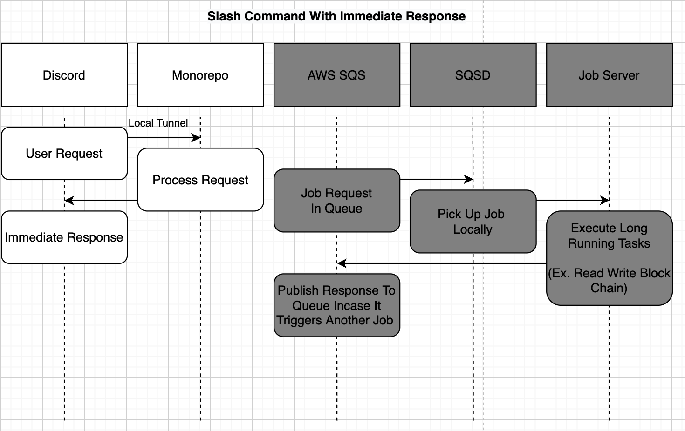

# Creating A Slash Command

# Creating A Slash Command


(TODO: update diagram with Raymonds Refactor - put commands inside 3rd party component, not discord component)

First we’ll create a simple Discord Slash command handler 



Awesome! We’ve successfully deployed one of the existing tutorial slash commands. Not it’s our turn to create a command from scratch.

## Step 1: Create a new Discord command File

<aside>
⚠️ We’ll show how to create a new Discord command using the existing Discord Component for simplicity and to demonstrate how to create, build, and deploy. 

3rd party commands registered in the `components/discord` **will NOT be merged**.
Complete the next tutorial **“Creating A Slash Command That Calls A Job”** to learn how to create and register your own component.

</aside>

### 1. Create a Discord Command File

To create a new discord command run the following command from the root directory

```bash

touch components/discord/src/commands/hello-goodbye.command.ts
```

### 2. Populate Example Discord Command

Next use your IDE or command line to open the file and paste in the following contents
Note: Since there is already documentation on how to create a slash command we will not cover the purpose of all the functions. That documentation can be found here[HERE LINK - Above in this file for now]

```tsx
// Copyright Abridged, Inc. 2021. All Rights Reserved.
// Node module: @collabland/component-discord
// This file is licensed under the MIT License.
// License text available at https://opensource.org/licenses/MIT

import{BindingScope, extensionFor, injectable, inject} from '@loopback/core';
import{
  APIInteractionResponse,
  ApplicationCommandType,
  InteractionResponseType,
  ApplicationCommandOptionType,
  MessageFlags,
} from 'discord-api-types/v10';
import{CommandInteraction} from 'discord.js';
import{
  DiscordCommandHandler,
  DISCORD_COMMAND_HANDLER_EXTENSION_POINT,
} from '../types';
import{debugFactory} from '@collabland/common';
import{DISCORD_SERVICE} from '../keys';
import{DiscordService} from '../services';
const debug = debugFactory('collabland:discord:commands:hello-goodbye');

@injectable(
  {
scope: BindingScope.SINGLETON,
},
  extensionFor(DISCORD_COMMAND_HANDLER_EXTENSION_POINT),
)
export class HelloGoodbyeSlashCommandHandler implements DiscordCommandHandler{
constructor(
    @inject(DISCORD_SERVICE) private service: DiscordService,
) {}

name = 'hello-goodbye';
  commandType = ApplicationCommandType.ChatInput;
  description =
    'A command for new developers to test the discord command response';
  options =[
    {
name: 'your-name',
      description: "Name of person we're greeting",
      type: ApplicationCommandOptionType.String as number,
      required: true,
},
];

  async handle(
    interaction: CommandInteraction,
): Promise<APIInteractionResponse> {
debug('interaction:');

    const yourName = interaction.options.getString('your-name')!;
    debug('Your Name: %s', yourName);

    await interaction.deferReply({ephemeral: true});

    const message = this.service.buildNotificationMessage({
embed:{
description: `Hello ${yourName}, Good Bye ${yourName}`,
        color: 'PURPLE',
        title: 'Hello Goodbye Slash Command',
        thumbnail: false,
},
      link:{
label: 'More Info',
        url: 'https://dev.collab.land/docs/intro',
},
});
    await interaction.editReply(message);

    const response: APIInteractionResponse ={
type: InteractionResponseType.ChannelMessageWithSource,
      data:{
content: `Unused Response never reaches output`,
        flags: MessageFlags.Ephemeral,
        components:[],
},
};
    return response;
}
}
```

## Step 2: Register a new command [Duplicated & Slightly Edited]

To register a discord command with the project we'll include the command in `discord/src/commands/index.ts` as well as `discord/src/discord.components.ts`

### 1. Update `discord/src/commands/index.ts`

First lets edit `discord/src/commands/index.ts`

Open this file and paste at the bottom

```tsx
export * from './hello-goodbye.command';
```

### 2. Update `discord/src/discord.components.ts`

Next let's edit `discord/src/discord.components.ts`
Open this file and paste at this import in the imports section

```tsx
import{HelloGoodbyeSlashCommandHandler} from './commands/hello-goodbye.command';
```

And register this service in the class export section

```tsx
...
export class DiscordComponent implements Component {
  services = [
    HelloGoodbyeSlashCommandHandler
...
```

## Step 3: Save and build

To rebuild the Discord components folder so that this command is available to the CLI run this command from the root directory

```bash
cd components/discord
npm run build
```

## Step 4: Deploy Test Slash Command with CLI to Guild [DUPLICATE FOR DIFF COMMAND NAME]

To deploy commands run the file `deploy-commands.sh` file created previously when deploying the `hello-world` command 

```bash
cd ../../
bash deploy-commands.sh
```

Wait for the process to start.  

🗒️ It can take up to 2 minutes to start.

Select the environment (Choose QA)

```bash
? Environment: (Use arrow keys)
❯ qa 
  production
```

Paste the guild id

```bash
Guild id (* for global commands): 950843846311444520
```

Select “register / update new commands”

```bash
? Main menu 
  Delete existing commands 
❯ Register/update new commands 
  Exit
```

Use the space bar to select commands you’d like to deploy.  For this tutorial let’s select the `hello-goodbye` command

```bash
 ◯ 👤 Guest Pass () 
 ◯ /join (Connect to wallets) 
 ◯ 👤 Verify user () 
❯◉ /hello-goodbye (A command for new developers to test creating their first discord command) *
 ◯ /hello-world (A command for new developers to test the discord command response) 
 ◯ /hello-world-job-server (A command for new developers to test that discord commands hit their local job server) 
 ◯ 👤 Check roles () 
 ◯ /tip (tip slash application command)
```

Press `Enter`

```bash
Register/update "hello-goodbye" command? (Y/n)
```

Type `Y`

Press `Enter`

You should see 

```bash
  Register/update "hello-goodbye" command? Yes
  collabland:discord Registering command hello-goodbye (A command for new developers to test the discord command response) +51s
  collabland:discord Application command registered: {
  collabland:discord   id: '988540914584670238',
  collabland:discord   application_id: '988126468599058432',
  collabland:discord   version: '988540914584670239',
  collabland:discord   default_permission: true,
  collabland:discord   default_member_permissions: null,
  collabland:discord   type: 1,
  collabland:discord   name: 'hello-goodbye',
  collabland:discord   name_localizations: null,
  collabland:discord   description: 'A command for new developers to test the discord command response',
  collabland:discord   description_localizations: null,
  collabland:discord   guild_id: '950843846311444520',
  collabland:discord   options: [
  collabland:discord     {
  collabland:discord       type: 3,
  collabland:discord       name: 'your-name',
  collabland:discord       name_localizations: null,
  collabland:discord       description: "Name of person we're greeting",
  collabland:discord       description_localizations: null,
  collabland:discord       required: true
  collabland:discord     }
  collabland:discord   ]
  collabland:discord } +154ms
Command id: 988540914584670238
```

Choose `Exit`

```bash
? Main menu 
  Delete existing commands 
  Register/update new commands 
❯ Exit
```

Nice! You’ve successfully deployed the command 

## Step 5: Test the Slash Command (Hello Goodbye)

### 1. Start the API server again

To Start the API Server run

```bash
aws-vault login dev
bash start-api-server.sh
```

### 2. Test the command from Discord

Open Discord

Go to the server you deployed the command into.

type `/hello-goodbye`

You should see the hello world command appear

input your name as the first variable field `/hello-goodbye your-name:caleb`

press `Enter`

**Expected Output**

