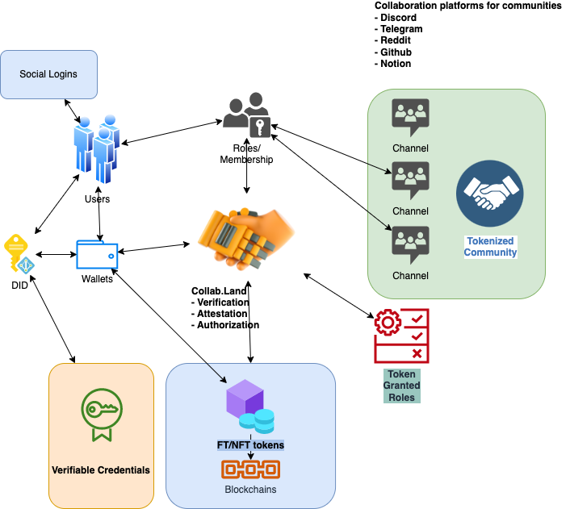

# Build Your Collab.Land Platform Extension

[Collab.Land](http://Collab.Land) provides solutions for bringing web2 users to web3. From web2, we now support platforms such as Discord, Telegram, and so on Reddit, Github, and Notion. To web3, we support the most of popular chains. Meanwhile, we are proactively decentralizing Collab.Land. We are also working with many different partners to build web3 network together.

To help build a decentralized network, we’d love to see more platforms connecting to web3 no matter it is a social media platform, a workspace, or a payment platform. If you’re interested in implementing an extension to join web3 with our infrastructure, our architecture allows you to build a pluggable extension with us easily. Read through to learn about [Collab.Land](http://Collab.Land) codebase and components more!

# Table of Contents

## [Basic concepts of LoopBack](./loopback-basics.md)

- Data access
- Naming convention
- Extension Point / extension
- Dependency Injection
- Example of dependency injection and extension point/extension
- Debug Strings

## [Getting started](./getting-started.md)

- Platform Extensions
- Basic Components/Services in Collab.Land

## [What You Need to Integrate Your Platform with Collab.Land ](./integrate-with-collabland.md)

- Flow Overview
- Wallet Connection
- Configuration

## [Wallet Connection](./wallet.connection.md)

- Authentication
- Wallet Connection
- Debugging

## [Token Permission Check Result Handling](./tpc-result-handling.md)

- Job Runner
- Debugging

## [Admin Configuration](./admin-configuration.md)

- Command Center
- Admin Command Center Login
- Debugging

## [Reddit Integration High-Level Overview](./reddit-integration-overview.md)

- Authentication
- User Management
- Admin Management
