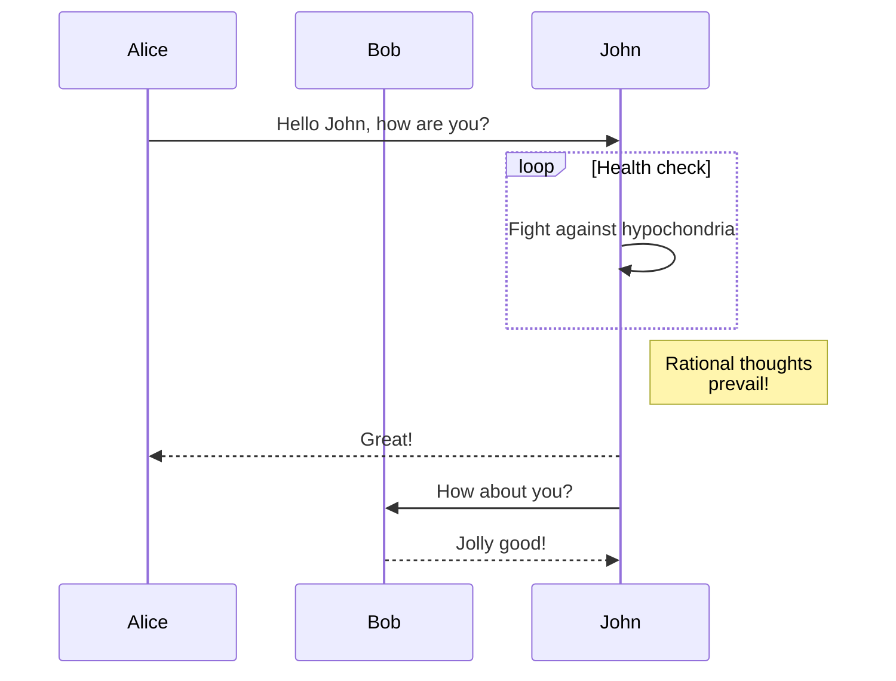

# Welcome to Collab.Land Help Docs

Collab.Land is a community management tool that supports a wide range of projects, including DAOs, NFT communities, brands, and creators of all sizes. Our mission is to provide tools that encourage pro-social activity within communities, particularly those that use tokens as a means of membership verification.

## What we do

We offer an automated process for verifying and managing community membership based on token ownership. This includes:
- [Token Gating](./key-features/token-gate-communities) - Initial verification to confirm that prospective members possess the required token(s) to join and participate in a community.
- Routine [balance checks](./command-center/bot-config/balance-check) to ensure that members continue to meet the community's requirements.

## Where to start

Creators and administrators can easily configure token-based access rules in our web portal, the [Command Center](https://cc.collab.land/login). Our platform supports token-based access on 23 different L1 and L2 networks using both fungible tokens and NFTs, and verifies membership using a choice of 22 wallets and an additional 19 wallets available via WalletConnect.

## Safety & Privacy

We prioritize the safety and privacy of our users. By connecting with an existing wallet, members can join new communities without having to sign a message for each one. We do not share verified wallet addresses with anyone, including community administrators, without explicit consent.

## Mermaid Test

