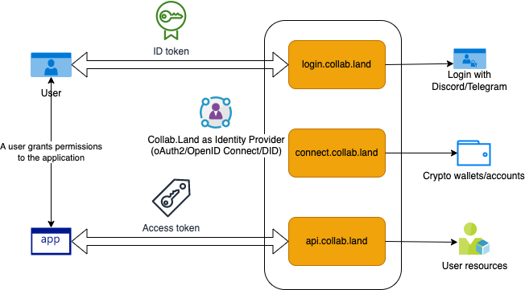
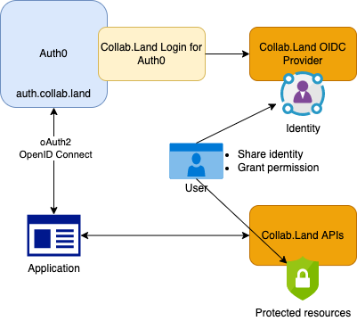

## Title

Login with CollabLand

## Simple Summary

This submission proposes a `Login with Collab.Land` solution to support two
use cases:

- allow dApps to identify a user with its crypto accounts verified by Collab.Land
  wallet connections

- allow API clients to authenticate a user with Collab.Land and request their permissions
  to invoke Collab.Land APIs on behalf of the user.

## Author

- Raymond Feng
  - Email: raymond@collab.land
  - Github: [@raymondfeng](https://github.com/raymondfeng)

## Created

2022-06-07

## Abstract

Collab.Land allows users to be identified with the following methods:

- Login with the platforms, such as Discord, Telegram, Reddit, or Github
- Login with a custodial account, such as Dapper, Eluvio, Nifty Gateway
- Login with a non-custodial wallet, such as Metamask, Wallet Connect, Phantom,
  and Blocto

The features are available at https://connect.collab.land and https://login.collab.land.

The proposal is to improve the following components into a universal login
solution:

- Collab.Land login site
- Collab.Land wallet connections site
- Collab.Land backend to verify wallet connections
- Collab.Land backend as an identity provider to support oAuth2/OpenID Connect flow

## Motivation

Collab.Land has the potential to become a web3 identity provider with its growing
list of options to verify users' identities with various platforms, custodial accounts,
and non-custodial wallets. Such features have been built as wallet connections to connect
Discord/Telegram users with their crypto wallets/accounts that hold assets for token gating
purposes.

## Risks

`Login with Collab.Land` could present the following risks:

- Becomes a target for phishing
- Take responsibility to manage users' connected accounts

Mitigation:

## Opportunity

- Provide a powerful login experience with web3
- Ensure API security to protect users' data

## User Impact

[The User Impact identifies how the user will be impacted either through UI, UX, performance, value, or any other net positive or negatives of the proposed change. In under 1000 characters]
Example:

- Users will be able to enforce Multi-Factor Authentication (MFA)
- Users will get a universal CollabID across communities and platforms
- Users can use Collab.Land to share crypto wallet addresses with other DApps
- Users will be able to grant/revoke permissions to third party applications

## Specification

[The key words “MUST”, “MUST NOT”, “REQUIRED”, “SHALL”, “SHALL NOT”, “SHOULD”, “SHOULD NOT”, “RECOMMENDED”, “MAY”, and “OPTIONAL”. The technical specification should describe the semantics of any new feature. The specification should be detailed enough to allow technical solution design to be validated or challenged interoperable implementations for any of the current Collab.Land repositories. It is completely acceptable to link to external diagrams or additional subject specific documents that can be made available for review by the DAO]

## Deliverables

1. Create an OpenID Connect provider for Collab.Land to generate ID tokens (`id_token`) for users
2. Create a CollabID (based on Gnosis safe) to unify all identifiers for the user
3. Improve `login.collab.land` site to support login with Collab.Land with crypto wallets
4. Leverage `connect.collab.land` site for authentications (UI and backend APIs)
5. Manage user identifiers on `user settings` page to control which providers can be used for login
6. Integrate with other DID providers such as Nuggets
7. Stretched: Build a PoC to integrate with Auth0

## Backwards Compatibility

[All CLIPs that introduce backwards incompatibilities must include a section describing these incompatibilities and their severity. The CLIP must explain how the author proposes to deal with these incompatibilities. CLIP submissions without a sufficient backwards compatibility treatise may be rejected outright.]

## Test Cases

[Test cases for an implementation are mandatory for CLIPs that are affecting consensus changes. If the test suite is too large to reasonably be included inline, then consider adding references to the project, branch, and files to which the tests have been added.]

## Reference Implementation

[An optional section that contains a reference/example implementation that people can use to assist in understanding or implementing this specification. If the implementation is too large to reasonably be included inline, then consider adding references to the project, branch, and files to which the implementation has been added.]
Security Considerations
[All CLIPs must contain a section that discusses the security implications/considerations relevant to the proposed change. Including information that might be important for security discussions, surface risks can be used throughout the life cycle of the proposal. E.g. include security-relevant design decisions, concerns, important discussions, implementation-specific guidance and pitfalls, an outline of threats and risks and how they are being addressed. CLIP submissions missing the "Security Considerations" section will be rejected. A CLIP cannot proceed to status "Final" without a Security Considerations discussion deemed sufficient by the reviewers.]

## Dependencies

Collab.Land teams will be needed to support the following areas:

- API Updates
- Backend Apps
- Design Updates
- FrontEnd Development

## Total Ask

[If this CLIP requires additional funds, support, or personnel please outline in this section of the total considerable ask would be to be approved by the Collab.Land DAO]

## References

1. [Sign In With Ethereum (SIWE), Now Available on Auth0](https://auth0.com/blog/sign-in-with-ethereum-siwe-now-available-on-auth0/)
2. [SIWE Auth0 integration](https://marketplace.auth0.com/integrations/siwe)
3. [Self-Issued OpenID Provider V2 – (Optional) Enables End-users to use OpenID Providers (OPs) that they control](https://openid.net/specs/openid-connect-self-issued-v2-1_0.html)
4. [OpenID Connect for Verifiable Presentations – (Optional) Enables request and presentation of W3C Verifiable Presentations via OpenID Connect](https://openid.net/specs/openid-connect-4-verifiable-presentations-1_0.html)
5. [node-oidc-provider](https://github.com/panva/node-oidc-provider)
