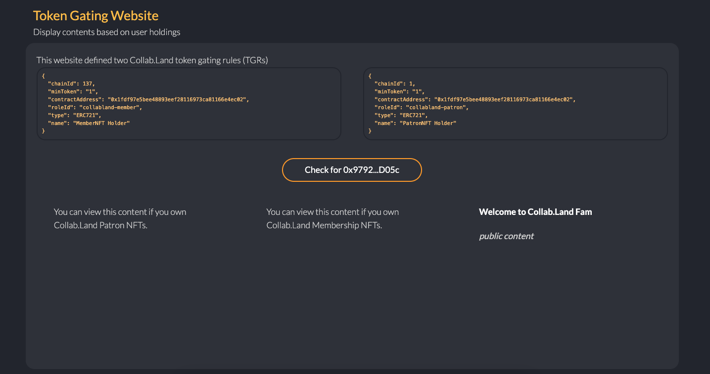

# Collab.Land Token Gating Tutorial

## Overview

This guide walks you through creating your own token gate for your website using the Collab.Land API. This enables you to restrict access to elements of or pages of your site based on ownership of certain blockchain assets.

### Website Gating Logic Flow

View logic diagram [on whimsical](https://whimsical.com/embed/S5jqcu5XzqBrnRtvgrPBj1@2Ux7TurymNLRX4obG1NB).

This tutorial implements gating logic by calling Collab.Land API [`access-control/check-roles`](../docs/downstream-integrations/api/token-gating.md) with a user's wallet address and [token gating rules](#token-grating-rule) as the payload and returns `true/false` for each rule to indicate if the given address fits the provided criteria or not.

### API

- [`access-control/check-roles`](../docs/downstream-integrations/api/token-gating.md) endpoint.

To call Collab.Land APIs, you will need to register an API key for your client application. In addition, your API key needs a specific scope (`token-gating`) to call this token gating endpoint. You can [request API access here](../docs/downstream-integrations/index.md#request-api-access).

This endpoint is also available in the Collab.Land SDK:

```
await getCollabClient().accessControl.checkRoles({
        account: <wallet_address>,
        rules: [{...}],
      });
```

<!-- TODO: Read <add_docs> to understand how Collab.Land API provides fine-grained control. -->

### Token Gating Rule

Token gating rules (TGR) are schemas describe required tokens. TGRs usually include token information such as chain id, contract address, token types, metadata, min/max required amount, etc. The following is an example TGR that requires at least one NFT of contract address `0xbc4ca0eda7647a8ab7c2061c2e118a18a936f13d` on mainnet.

```json
"rules": [
    {
      "type": "ERC721",
      "chainId": 1,
      "minToken": "1",
      "contractAddress": "0xbc4ca0eda7647a8ab7c2061c2e118a18a936f13d",
      "roleId": "001"
    }
  ]
```

Collab.Land support many FTs and NFTs on many chains. Please see [Configuring your TGRs](../docs/local-development-setup/configuring-tgr.md) for rule definition details.

## Tutorial

The following are steps and explanations of our [token gating website example](https://github.com/abridged/collabland-tutorials/tree/master/token-gating-website). Notice that a Collab.Land API key is required to run the demo locally.

### 1. Request an API Key

See [API section](#api)

### 2. API payload

#### 2.1 Get user's wallet address

A wallet `address` is part of the token gating API payload. Your app will get the user wallet address and pass it to the endpoint. In the future, Collab.Land may expose the Collab.Land wallet connect UI component for developers to use.

In this demo, we use [Sign-in with Ethereum](https://login.xyz/) to get user's wallet address. You can use your preferred wallet provider to obtain a user's wallet address. You can also add sessions to logins based on your use case.

If you need some help to get user addresses:

- [Sign-In with Ethereum](https://docs.login.xyz/) method is easy to adopt securely.
- Add “Connect Wallet” button to your website [tutorial from ThirdWeb](https://blog.thirdweb.com/guides/add-connectwallet-to-your-website/) is also a popular option.

#### 2.2 Define Token Gating Rules

TGRs is part of the payload of the API. These are the rules that the wallet assets will be checked against by the Collab.Land. The API will return boolean `true`/`false` for each rule to indicate if the account address fulfills the defined rules or not.

Please see [Configuring your TGRs](../docs/local-development-setup/configuring-tgr.md) for rule definition details.

### 3. Call the Collab.Land API

In this demo, we use [Collab.Land SDK](../docs/downstream-integrations/sdk/index.md) to call the API:

```
const res = await getCollabClient().accessControl.checkRoles({
  account: addr,
  rules: [
    {
      chainId: 137,
      minToken: '1',
      contractAddress: '0x1fdf97e5bee48893eef28116973ca81166e4ec02',
      roleId: MEMBER_ROLE,
      type: 'ERC721',
      name: 'MemberNFT Holder',
    },
    {
      chainId: 1,
      minToken: '1',
      contractAddress: '0x1fdf97e5bee48893eef28116973ca81166e4ec02',
      roleId: PATRON_ROLE,
      type: 'ERC721',
      name: 'PatronNFT Holder',
    },
  ],
});
```

`fetch` would also work:

```
  const res = await fetch(`https://api-qa.collab.land/access-control/check-roles`, {
    method: 'POST',
    headers: new Headers({
      Accept: 'application/json',
      'X-API-KEY': process.env.COLLABLAND_KEY,
      'Content-Type': 'application/json',
    }),
    body: JSON.stringify({
      account: myWalletAddr,
      rules: [
        ...
      ]
    })
  });
```

### 4. Handle API response

There are several response options available with the Collab.Land API. Select which method you would like to use.

#### Sync with polling

https://dev.collab.land/docs/downstream-integrations/api/token-gating#check-roles-synchronously

- receive `true`/`false` from API for each token gating rule

**Sample response:**

```
{
  "roles": [
    {
      "id": "my-role-001",
      "granted": true
    },
    {
      "id": "another-role-002",
      "granted": false
    }
  ]
}
```

#### Async via callback URI

https://dev.collab.land/docs/downstream-integrations/api/token-gating#check-roles-asynchronously

- receive callback URL and a notification via webhook at that URL when API data is available

#### Async via callback with polling

https://dev.collab.land/docs/downstream-integrations/api/token-gating/#check-roles-asynchronously-and-poll-for-the-result

- receive a `requestId` from API and poll for result

### 5. Render gated content based on API response

Your app can display page content or new pages based on the `true`/`false` response of the Collab.Land API. In this demo, we simply display page contents based on the API response.

#### React example code

This code snippet displays certain content when each rule returns `true`.

```
  // React component
  ...
  const [isPatron, setIsPatron] = useState<boolean>(false);
  const [isMember, setIsMember] = useState<boolean>(false);
  ...

  const checkRoles = async () => {
    await connectToSDK();
    const apiResponse = await getCollabClient().accessControl.checkRoles({
      account: addr,
      rules: [
        {
          chainId: 137,
          minToken: '1',
          contractAddress: '0x1fdf97e5bee48893eef28116973ca81166e4ec02',
          roleId: MEMBER_ROLE,
          type: 'ERC721',
          name: 'MemberNFT Holder',
        },
        {
          chainId: 1,
          minToken: '1',
          contractAddress: '0x1fdf97e5bee48893eef28116973ca81166e4ec02',
          roleId: PATRON_ROLE,
          type: 'ERC721',
          name: 'PatronNFT Holder',
        },
      ],
    });
    //
    for (const role of apiResponse.roles) {
      if (role.granted) {
        switch (role.id) {
          case PATRON_ROLE: // set to true if PATRON_ROLE rule returns true
            setIsPatron(true);
            break;
          case MEMBER_ROLE: // set to true if MEMBER_ROLE rule returns true
            setIsMember(true);
            break;
        }
      }
    }
  }

  ...

  return (
    <div>
      {isPatron ? (
        <div>
          Hey Patron NFT Holder! ❤️ 🖤
          ...
        </div>
      ) : (
        <div>
          You can view this content if you own Collab.Land Patron
          NFTs.
        </div>
      )}
      {isMember ? (
        <div>
          Hey Membership NFT Holder!
        </div>
      ) : (
        <div>
          You can view this content if you own Collab.Land
          Membership NFTs.
        </div>
      )}
    </div>
  )
```



**When both rules are `true`:**

